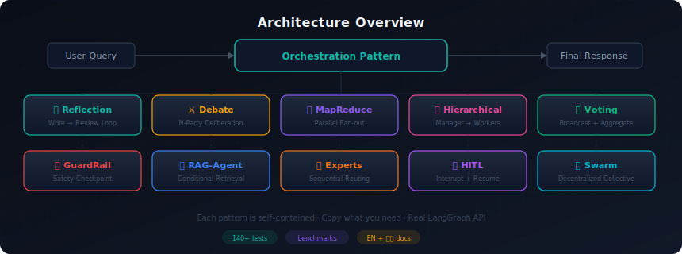
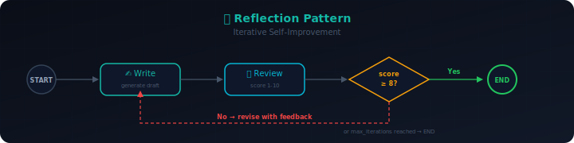
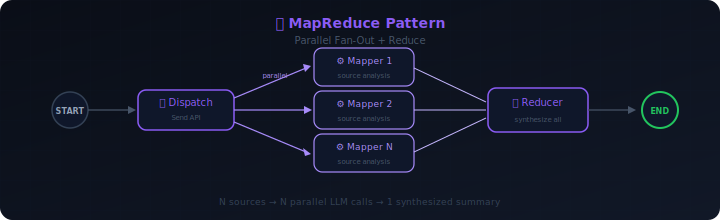

# 🔀 AgentFlow

[**English**](README.md) | **简体中文**

**基于 LangGraph 的多 Agent 协作设计模式实战库**

AgentFlow 是一套经过验证的多 Agent 设计模式合集，基于 [LangGraph](https://github.com/langchain-ai/langgraph) 构建。每个模式都包含完整代码、架构图、适用场景分析和性能对比。

> **不是框架封装，不是教程合集。** 这是多 Agent 系统的 **设计模式参考书**。

**在线演示：** https://iuyup.github.io/AgentFlow


## 架构概览



### 模式示例：Reflection（反思模式）



### 模式示例：MapReduce（映射归约模式）



> **运行截图和演示：** 访问[文档网站](https://iuyup.github.io/AgentFlow)查看交互示例和运行截图。

## 为什么需要 AgentFlow？

构建多 Agent 系统的难点不在工具，而在 **架构决策**：

- Agent 应该循环还是终止？
- 如何协调 N 个 Agent 而不混乱？
- 什么时候并行优于串行？

AgentFlow 提供 **经过验证的模式**，你可以学习、改造、组合 —— 每个模式都是完整的、可运行的示例。

## 模式索引

| 模式 | 说明 | 核心技术 | 状态 |
|------|------|----------|------|
| [Reflection（反思）](web/docs/patterns/reflection/) | 通过「写作 → 审阅」循环实现迭代自改进 | 条件循环 | ✅ |
| [Debate（辩论）](web/docs/patterns/debate/) | 多视角辩论 + 主持人综合裁决 | N 方协调 | ✅ |
| [MapReduce（映射归约）](web/docs/patterns/map_reduce/) | 并行扇出处理 + 结果聚合 | LangGraph Send API | ✅ |
| [Hierarchical（层级委派）](web/docs/patterns/hierarchical/) | Manager 分解任务 → Workers 执行 → Manager 汇总 | 嵌套子图 + Send | ✅ |
| [Voting（投票决策）](web/docs/patterns/voting/) | 多 Agent 独立投票后聚合 | 广播扇出 | ✅ |
| [GuardRail（风控守门）](web/docs/patterns/guardrail/) | 主 Agent + 安全守门检查点 | Approve/block/redirect 路由 | ✅ |
| [RAG-Agent（检索增强）](web/docs/patterns/rag_agent/) | Agent 自主决定何时从知识库检索 | 条件检索循环 | ✅ |
| [Chain-of-Experts（专家链）](web/docs/patterns/chain_of_experts/) | 任务在专家 Agent 间依次传递 | 顺序路由 | ✅ |
| [Human-in-the-Loop（人机协作）](web/docs/patterns/human_in_the_loop/) | 关键节点等待人类确认 | 中断 + 恢复 | ✅ |
| [Swarm（群体智能）](web/docs/patterns/swarm/) | 去中心化 Agent 群体协作 | 动态编排 | ✅ |

## 快速开始

### 1. 克隆 & 安装

```bash
git clone https://github.com/iuyup/AgentFlow.git
cd AgentFlow
uv sync
```

### 2. 配置 API Key

```bash
cp .env.example .env
# 编辑 .env，填入你的 OpenAI API Key
```

### 3. 运行任意模式

```bash
python -m patterns.reflection.example
python -m patterns.debate.example
python -m patterns.map_reduce.example
```

### 4. 浏览文档网站

```bash
cd web
pip install -r requirements.txt
python sync_docs.py    # 同步模式文档
mkdocs serve          # 访问 http://localhost:8000
```

## 项目结构

```
patterns/                  # 核心：每个模式一个子目录
│   ├── reflection/        # 写作 → 审阅循环
│   ├── debate/            # N 方辩论 + 主持人
│   ├── map_reduce/        # 并行扇出 + 归约
│   ├── hierarchical/      # Manager → Workers → 汇总
│   ├── voting/            # 多 Agent 投票 + 聚合
│   ├── guardrail/         # 主 Agent + 安全守门
│   ├── rag_agent/         # Agent + 条件检索
│   ├── chain_of_experts/  # 顺序专家路由
│   ├── human_in_the_loop/ # 人工中断
│   └── swarm/             # 去中心化编排
├── agentflow/             # 核心工具函数
├── web/                   # 文档网站 (MkDocs)
│   ├── docs/             # 文档源文件
│   ├── mkdocs.yml        # 网站配置
│   └── sync_docs.py      # 文档同步脚本
├── benchmarks/            # 性能对比框架
└── tasks/                # 进度追踪
```

## 文档网站

文档网站使用 **MkDocs + Material** 构建，位于 `web/` 目录：

```bash
# 本地预览
cd web
pip install -r requirements.txt
python sync_docs.py    # 同步文档
mkdocs serve          # 访问 http://localhost:8000

# 构建静态站点
mkdocs build

# 部署到 GitHub Pages
mkdocs gh-deploy
```

## 环境要求

- Python 3.11+
- OpenAI API Key（默认模型：`gpt-4o-mini`）

## 运行测试

```bash
# 单元测试（无需 API Key）
pytest patterns/

# 集成测试（需要 OPENAI_API_KEY）
OPENAI_API_KEY=your-key pytest patterns/ -m "not skipif"
```

## 设计理念

1. **模式参考，不是框架** — 每个模式独立自包含，按需复制。
2. **3 分钟可运行** — 克隆、配置 Key、运行，就这么简单。
3. **双语文档** — 每个模式都有英文和中文 README。
4. **真实 LangGraph** — 不封装 LangGraph，学习原生 API。

## 贡献指南

参见 [CONTRIBUTING.md](CONTRIBUTING.md)。

## 许可证

MIT
