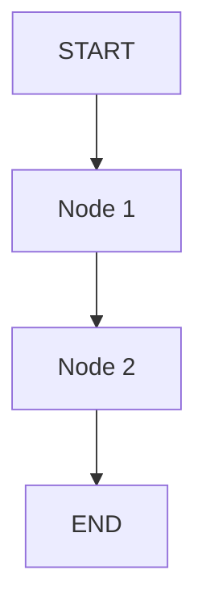

# Pattern Name

> One-line description of what this pattern does.

## When to Use

- Scenario 1
- Scenario 2

## When NOT to Use

- Anti-scenario 1
- Anti-scenario 2

## Architecture



## Key Concepts

Explain the core idea in 2-3 paragraphs.

## Quick Start

```bash
cd patterns/pattern_name
python example.py
```

## Core Code

```python
# Show the most important 20-30 lines
```

## How It Works

Step-by-step explanation of the graph flow.

## Configuration

| Parameter | Default | Description |
|-----------|---------|-------------|
| `param1` | `value` | What it does |

## Comparison with Other Patterns

| Aspect | This Pattern | Alternative |
|--------|-------------|-------------|
| Use case | ... | ... |

## Example Output

```
Show typical output here
```
