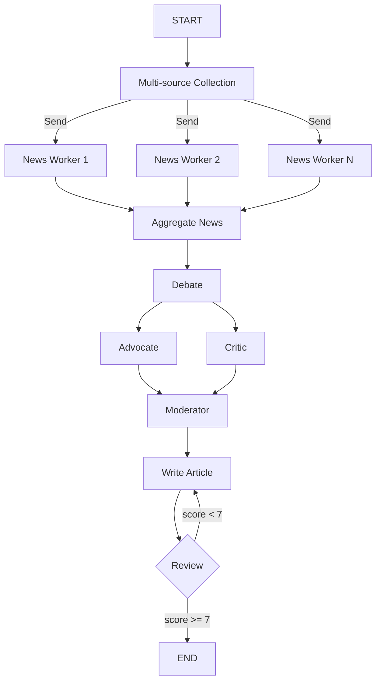

# AI Newsroom

> Multi-stage news production pipeline combining MapReduce + Debate + Reflection for complete news workflow from multi-source collection to editorial review.

## When to Use

- **Multi-source news reporting** — requiring perspectives from different sources
- **In-depth topic analysis** — needing pro/con debate for comprehensive coverage
- **Quality-sensitive content production** — requiring iterative polishing until publication standard
- **Simulating newsroom workflows** — role collaboration with editor-in-chief, reporters, and reviewers

## When Not to Use

- **Simple news aggregation** — no need for debate and polishing
- **Real-time news feeds** — iterative polishing adds latency
- **Single-source reporting** — MapReduce parallelism won't help
- **Creative writing** — debate mode unsuitable for creative content

## Architecture



## Core Concepts

**AI Newsroom** is a three-layer nested multi-agent system:

1. **MapReduce Layer** — Parallel multi-source news collection
   - Multiple `news_worker` collect news from different sources in parallel
   - `aggregate_news` combines all collected results

2. **Debate Layer** — Dual-role debate + moderator
   - `Advocate` argues for the topic's significance
   - `Critic` presents critical counterpoints
   - `Moderator` synthesizes into editorial conclusion

3. **Reflection Layer** — Write-Review iteration until quality threshold
   - `write_article` generates first draft
   - `review_article` scores (1-10)
   - Score < 7.0 returns to write, max 2 iterations

## Quick Start

```python
from examples.ai_newsroom import AINewsroom

newsroom = AINewsroom()
result = newsroom.run(
    topic="Impact of AI on the news industry",
    sources=["Reuters", "BBC", "NYTimes"]
)

# Access results
print(result["polished_article"])    # Final polished article
print(result["reflection_score"])     # Final review score
```

## Core Code

```python
class AINewsroom:
    def __init__(self, model=None, llm=None):
        self.llm = llm or _default_llm(model)

    def _collect_news(self, state: NewsroomState) -> list[Send]:
        """MapReduce-style: parallel dispatch to news_workers"""
        return [
            Send("news_worker", {"source": source, "topic": state["topic"]})
            for source in state["sources"]
        ]

    def _should_revise(self, state: NewsroomState) -> str:
        """Reflection conditional routing: end if score >= 7 or max iterations"""
        if state.get("iteration", 0) >= 2:
            return "end"
        if state.get("score", 0) >= 7.0:
            return "end"
        return "continue"
```

## Workflow

1. **News Collection** — Parallel collection from multiple sources (simulated)
2. **News Aggregation** — Combine all collected news
3. **Debate** — Advocate and Critic debate concurrently
4. **Moderation** — Moderator synthesizes debate into editorial conclusion
5. **Write Article** — Generate article based on editorial guidance
6. **Review** — Score < 7 returns to step 5; otherwise complete

## Configuration

| Parameter | Default | Description |
|-----------|---------|-------------|
| `model` | `gpt-4o-mini` | LLM model name |
| `llm` | `None` | Pre-configured LLM instance |
| `sources` | — | List of news sources (at least 1) |
| `max_iterations` | `2` | Reflection max iterations |

## Output Fields

| Field | Type | Description |
|-------|------|-------------|
| `polished_article` | `str` | Final polished article |
| `reflection_score` | `float` | Final review score |
| `collected_news` | `list[dict]` | News from each source [{source, article}] |
| `debate_history` | `list[dict]` | Debate record [{speaker, argument}] |
| `final_decision` | `str` | Moderator's editorial conclusion |

## Composed Patterns

- **[MapReduce](../patterns/map_reduce/README.md)** — Multi-source parallel collection
- **[Debate](../patterns/debate/README.md)** — Pro/con debate
- **[Reflection](../patterns/reflection/README.md)** — Iterative quality improvement

## Example Output

```
Input:
  topic: "Impact of AI on the news industry"
  sources: ["Reuters", "BBC", "NYTimes"]

Execution:
  1. [MapReduce] Collect news from 3 sources in parallel
  2. [Debate] Advocate vs Critic debate
  3. [Moderator] Synthesize into editorial conclusion
  4. [Reflection] Write → Review(8.5) → Pass

Output:
  polished_article: "## AI is Reshaping the News Industry\n\n..."
  reflection_score: 8.5
  collected_news: [{source: "Reuters", article: "..."}, ...]
  debate_history: [{speaker: "Advocate", argument: "..."}, ...]
```
