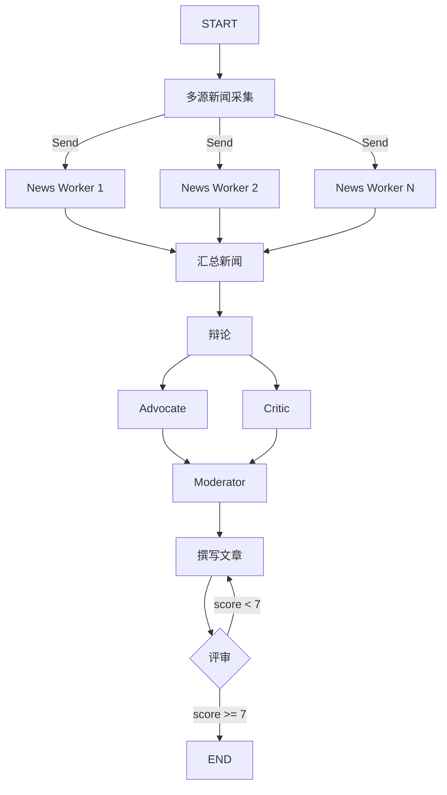

# AI Newsroom（AI 新闻工作室）

> 多阶段新闻生产流水线，组合 MapReduce + Debate + Reflection 三种模式，实现从多源采集到辩论评审的完整新闻生产流程。

## 适用场景

- **多源新闻报道**——需要整合不同来源的观点和信息
- **深度专题分析**——需要正反方辩论来全面呈现议题
- **质量敏感的内容生产**——需要迭代润色直到达到发布标准
- **模拟新闻编辑部工作流**——主编 + 记者 + 评审的角色协作

## 不适用场景

- **简单新闻聚合**——不需要辩论和润色的简单采集
- **实时新闻流**——迭代润色带来延迟
- **单来源报道**——MapReduce 的并行优势无法发挥
- **创意写作**——辩论模式不太适合创意性内容

## 架构图



## 核心概念

**AI Newsroom** 是一个三层嵌套的多 Agent 系统：

1. **MapReduce 层** — 并行采集多源新闻
   - 多个 `news_worker` 从不同 source 并行收集新闻
   - `aggregate_news` 汇总所有采集结果

2. **Debate 层** — 双角色辩论 + 主持人裁判
   - `Advocate`（支持方）阐述议题重要性
   - `Critic`（质疑方）提出批评和反驳
   - `Moderator`（主编）综合形成编辑结论

3. **Reflection 层** — Write-Review 迭代直到质量达标
   - `write_article` 生成初稿
   - `review_article` 评分（1-10）
   - 分数 < 7.0 则返回继续迭代，最多 2 轮

## 快速开始

```python
from examples.ai_newsroom import AINewsroom

newsroom = AINewsroom()
result = newsroom.run(
    topic="AI对新闻行业的影响",
    sources=["路透社", "BBC", "纽约时报"]
)

# 访问结果
print(result["polished_article"])    # 最终新闻文章
print(result["reflection_score"])     # 最终得分
```

## 核心代码

```python
class AINewsroom:
    def __init__(self, model=None, llm=None):
        self.llm = llm or _default_llm(model)

    def _collect_news(self, state: NewsroomState) -> list[Send]:
        """MapReduce-style: 并行分发到多个 news_worker"""
        return [
            Send("news_worker", {"source": source, "topic": state["topic"]})
            for source in state["sources"]
        ]

    def _should_revise(self, state: NewsroomState) -> str:
        """Reflection 条件路由: 分数 >= 7 或达到最大迭代次数则结束"""
        if state.get("iteration", 0) >= 2:
            return "end"
        if state.get("score", 0) >= 7.0:
            return "end"
        return "continue"
```

## 工作流程

1. **新闻采集** — 并行从多个来源收集新闻（模拟）
2. **新闻汇总** — 聚合所有采集的新闻
3. **辩论阶段** — Advocate 和 Critic 并发辩论
4. **主编综合** — Moderator 综合辩论形成编辑结论
5. **撰写文章** — 基于编辑指导和原始新闻生成文章
6. **质量评审** — 评分 < 7 则返回第 5 步继续迭代

## 配置参数

| 参数 | 默认值 | 说明 |
|------|--------|------|
| `model` | `gpt-4o-mini` | LLM 模型名称 |
| `llm` | `None` | 预配置的 LLM 实例 |
| `sources` | — | 新闻来源列表（至少 1 个） |
| `max_iterations` | `2` | Reflection 最大迭代次数 |

## 输出字段

| 字段 | 类型 | 说明 |
|------|------|------|
| `polished_article` | `str` | 最终润色后的文章 |
| `reflection_score` | `float` | 最终评审得分 |
| `collected_news` | `list[dict]` | 各来源的新闻 [{source, article}] |
| `debate_history` | `list[dict]` | 辩论记录 [{speaker, argument}] |
| `final_decision` | `str` | 主编的编辑结论 |

## 组合的 Pattern 详解

- **[MapReduce](../patterns/map_reduce/README_zh.md)** — 多源并行采集
- **[Debate](../patterns/debate/README_zh.md)** — 正反方辩论
- **[Reflection](../patterns/reflection/README_zh.md)** — 迭代质量提升

## 示例输出

```
输入：
  topic: "AI对新闻行业的影响"
  sources: ["路透社", "BBC", "纽约时报"]

流水线执行：
  1. [MapReduce] 从 3 个来源并行采集新闻
  2. [Debate] Advocate vs Critic 辩论
  3. [Moderator] 综合形成编辑结论
  4. [Reflection] 撰写 → 评审(8.5) → 通过

输出：
  polished_article: "## AI 正在重塑新闻行业\n\n..."
  reflection_score: 8.5
  collected_news: [{source: "路透社", article: "..."}, ...]
  debate_history: [{speaker: "Advocate", argument: "..."}, ...]
```
