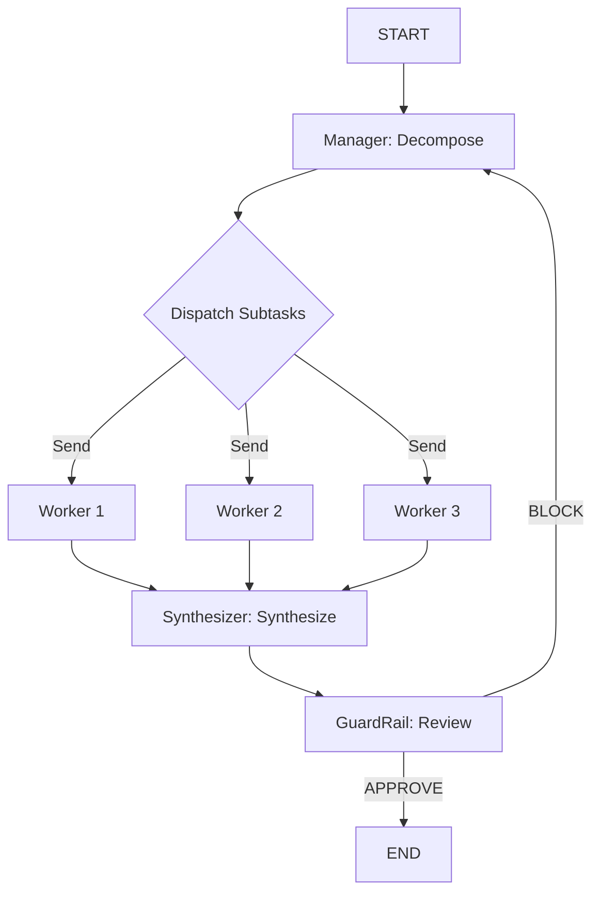

# Research Team

> Research pipeline combining Hierarchical + GuardRail patterns, implementing complete research flow from task decomposition to parallel research to quality review.

## When to Use

- **Complex research tasks** — requiring multi-dimensional analysis (market, technology, competition)
- **Quality-controlled research** — requiring factual and logical review of outputs
- **Workflows needing automatic correction** — GuardRail triggers retry on rejection
- **Business decision support** — multi-dimensional analysis of risks, opportunities, regulations

## When Not to Use

- **Simple query tasks** — decomposition and synthesis overhead not worth it
- **Real-time requirements** — GuardRail review adds latency
- **Single-dimensional questions** — no need for parallel Workers
- **Tasks requiring external knowledge retrieval** — current implementation is pure LLM reasoning (extensible to RAG)

## Architecture



## Core Concepts

**Research Team** combines two core patterns:

1. **Hierarchical Pattern**
   - `Manager` decomposes complex problem into 3-4 independent sub-questions
   - Parallel dispatch to `Worker` for research
   - `Synthesizer` combines all results into complete report

2. **GuardRail Pattern**
   - Reviews report for accuracy, logical consistency, and safety
   - Outputs `APPROVE` or `BLOCK` verdict
   - `BLOCK` automatically returns to decomposition phase

## Quick Start

```python
from examples.research_team import ResearchTeam

team = ResearchTeam()
result = team.run("Analyze the current state and future prospects of the AI industry")

# Access results
print(result["research_report"])     # Final research report
print(result["guardrail_verdict"])   # APPROVE or BLOCK
print(result["worker_results"])      # Research results from each Worker
```

## Core Code

```python
class ResearchTeam:
    def _decompose(self, state: ResearchTeamState) -> dict:
        """Manager decomposes question into sub-questions"""
        messages = [
            SystemMessage(content=MANAGER_PROMPT),
            HumanMessage(content=f"Research question: {state['question']}"),
        ]
        response = self.llm.invoke(messages)
        # Parse JSON format sub-questions
        sub_questions = json.loads(response.content)
        return {"sub_questions": sub_questions}

    def _guardrail(self, state: ResearchTeamState) -> dict:
        """Review report, return APPROVE or BLOCK"""
        # Check accuracy, logical consistency, harmful content
        return {
            "guardrail_verdict": verdict,  # APPROVE or BLOCK
            "guardrail_feedback": feedback,
        }

    def _should_retry(self, state: ResearchTeamState) -> str:
        """GuardRail conditional routing: BLOCK returns to decompose"""
        if state.get("guardrail_verdict") == "APPROVE":
            return "approve"
        return "retry"
```

## Workflow

1. **Decomposition** — Manager splits question into 3-4 independent sub-questions
2. **Parallel Research** — Each Worker researches their sub-question concurrently
3. **Synthesis** — Synthesizer combines all Worker results into complete report
4. **Quality Review** — GuardRail checks report quality
5. **Verdict** — APPROVE ends; BLOCK returns to step 1

## Configuration

| Parameter | Default | Description |
|-----------|---------|-------------|
| `model` | `gpt-4o-mini` | LLM model name |
| `llm` | `None` | Pre-configured LLM instance |

## Output Fields

| Field | Type | Description |
|-------|------|-------------|
| `question` | `str` | Original research question |
| `sub_questions` | `list[dict]` | Decomposed sub-questions [{task_id, question}] |
| `worker_results` | `list[dict]` | Worker research results [{task_id, question, answer}] |
| `research_report` | `str` | Final research report |
| `guardrail_verdict` | `str` | APPROVE or BLOCK |
| `guardrail_feedback` | `str` | Review feedback |
| `safety_violations` | `list[str]` | List of safety violations |

## Composed Patterns

- **[Hierarchical](../patterns/hierarchical/README.md)** — Hierarchical task decomposition
- **[GuardRail](../patterns/guardrail/README.md)** — Quality review

## Example Output

```
Input:
  question: "Analyze the current state and future prospects of the AI industry"

Execution:
  1. [Hierarchical] Manager decomposes into 4 sub-questions
  2. [Worker] Parallel research on each sub-question
  3. [Synthesizer] Synthesize into complete report
  4. [GuardRail] Review report
  5. [Verdict] APPROVE

Output:
  research_report: "## AI Industry Research Report\n\n### Technology Landscape\n..."
  guardrail_verdict: "approve"
  sub_questions: [{task_id: "q1", question: "Technology trends analysis"}, ...]
  worker_results: [{task_id: "q1", question: "Technology trends analysis", answer: "..."}, ...]
```
