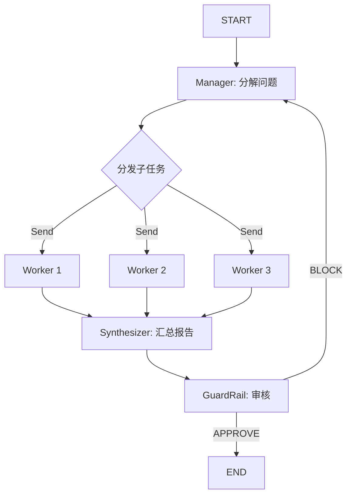

# Research Team（研究团队）

> 组合 Hierarchical + GuardRail 模式的研究 pipeline，实现从任务分解到并行研究再到质量审核的完整研究流程。

## 适用场景

- **复杂研究任务**——需要多维度分析（市场、技术、竞争格局）
- **需要质量把控的研究**——最终输出需要事实核查和逻辑审核
- **需要自动纠错的工作流**——GuardRail 拒绝时自动重试
- **商业决策支持**——风险、机会、监管等多维度综合分析

## 不适用场景

- **简单查询任务**——分解和汇总的开销不划算
- **实时性要求高的任务**——GuardRail 审核带来额外延迟
- **单一维度问题**——不需要多 Worker 并行
- **需要外部知识库检索**——当前实现是纯 LLM 推理（可扩展为 RAG）

## 架构图



## 核心概念

**Research Team** 组合了两种核心模式：

1. **Hierarchical（层级委派模式）**
   - `Manager` 将复杂问题分解为 3-4 个子问题
   - 并行分发给 `Worker` 研究
   - `Synthesizer` 将所有结果汇总为完整报告

2. **GuardRail（安全防护模式）**
   - 审核研究报告的准确性、逻辑一致性和安全性
   - 输出 `APPROVE` 或 `BLOCK` 裁决
   - `BLOCK` 时自动回到分解阶段重新开始

## 快速开始

```python
from examples.research_team import ResearchTeam

team = ResearchTeam()
result = team.run("分析 AI 行业的现状和未来发展前景")

# 访问结果
print(result["research_report"])     # 最终研究报告
print(result["guardrail_verdict"])   # APPROVE 或 BLOCK
print(result["worker_results"])      # 各 Worker 的研究结果
```

## 核心代码

```python
class ResearchTeam:
    def _decompose(self, state: ResearchTeamState) -> dict:
        """Manager 将问题分解为子问题"""
        messages = [
            SystemMessage(content=MANAGER_PROMPT),
            HumanMessage(content=f"Research question: {state['question']}"),
        ]
        response = self.llm.invoke(messages)
        # 解析 JSON 格式的子问题列表
        sub_questions = json.loads(response.content)
        return {"sub_questions": sub_questions}

    def _guardrail(self, state: ResearchTeamState) -> dict:
        """审核报告，返回 APPROVE 或 BLOCK"""
        # 检查准确性、逻辑一致性、有害内容
        return {
            "guardrail_verdict": verdict,  # APPROVE 或 BLOCK
            "guardrail_feedback": feedback,
        }

    def _should_retry(self, state: ResearchTeamState) -> str:
        """GuardRail 条件路由: BLOCK 时回到 decompose"""
        if state.get("guardrail_verdict") == "APPROVE":
            return "approve"
        return "retry"
```

## 工作流程

1. **问题分解** — Manager 将原始问题分解为 3-4 个独立子问题
2. **并行研究** — 每个 Worker 并发研究自己的子问题
3. **汇总报告** — Synthesizer 将所有 Worker 结果整合为完整报告
4. **质量审核** — GuardRail 检查报告质量
5. **裁决** — APPROVE 则结束；BLOCK 则回到第 1 步重新开始

## 配置参数

| 参数 | 默认值 | 说明 |
|------|--------|------|
| `model` | `gpt-4o-mini` | LLM 模型名称 |
| `llm` | `None` | 预配置的 LLM 实例 |

## 输出字段

| 字段 | 类型 | 说明 |
|------|------|------|
| `question` | `str` | 原始研究问题 |
| `sub_questions` | `list[dict]` | 分解后的子问题 [{task_id, question}] |
| `worker_results` | `list[dict]` | Worker 研究结果 [{task_id, question, answer}] |
| `research_report` | `str` | 最终研究报告 |
| `guardrail_verdict` | `str` | APPROVE 或 BLOCK |
| `guardrail_feedback` | `str` | 审核反馈 |
| `safety_violations` | `list[str]` | 安全违规列表 |

## 组合的 Pattern 详解

- **[Hierarchical](../patterns/hierarchical/README_zh.md)** — 层级任务分解
- **[GuardRail](../patterns/guardrail/README_zh.md)** — 质量审核

## 示例输出

```
输入：
  question: "分析 AI 行业的现状和未来发展前景"

流水线执行：
  1. [Hierarchical] Manager 分解为 4 个子问题
  2. [Worker] 并行研究各子问题
  3. [Synthesizer] 汇总为完整报告
  4. [GuardRail] 审核报告
  5. [裁决] APPROVE

输出：
  research_report: "## AI 行业研究报告\n\n### 技术格局\n..."
  guardrail_verdict: "approve"
  sub_questions: [{task_id: "q1", question: "技术趋势分析"}, ...]
  worker_results: [{task_id: "q1", question: "技术趋势分析", answer: "..."}, ...]
```
