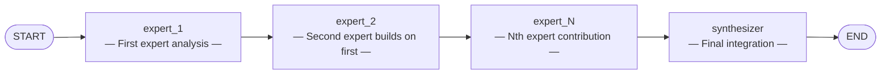

# Chain-of-Experts Pattern

> **Sequential expert processing pipeline where each specialist builds on the last.**

The Chain-of-Experts pattern passes a task through a chain of specialized expert agents, each adding their perspective before passing to the next expert. A final synthesizer integrates all contributions into a coherent output.

This pattern excels at complex tasks requiring multiple domain perspectives, where each expert's analysis builds upon and informs the next.

---

## When to Use

| Good fit | Poor fit |
|----------|----------|
| Complex research requiring multiple domain expert reviews | Simple, single-domain tasks |
| Document editing with sequential specialist passes | Tasks requiring parallel processing for speed |
| Multi-stage analysis where each expert builds on the previous | Tasks with a single correct answer |
| Legal, medical, or technical review pipelines | Situations needing immediate response |

---

## Architecture



**State** flows through the graph:

| Field | Type | Description |
|-------|------|-------------|
| `task` | `str` | The input task |
| `experts` | `list[dict]` | List of expert definitions [{name, specialty, system_prompt}] |
| `current_expert_index` | `int` | Index of the current expert being processed |
| `expert_outputs` | `list[dict]` | Accumulated outputs from each expert |
| `final_synthesis` | `str` | Final integrated output from synthesizer |

---

## Core Code

```python
from patterns.chain_of_experts.pattern import ChainOfExpertsPattern

pattern = ChainOfExpertsPattern()

experts = [
    {"name": "Legal Reviewer", "specialty": "legal analysis"},
    {"name": "Technical Expert", "specialty": "technical feasibility"},
    {"name": "Risk Analyst", "specialty": "risk assessment"},
]

result = pattern.run(
    task="Review this software license agreement",
    experts=experts,
)

print(result["final_synthesis"])  # Integrated expert analysis
```

### Configuration Options

| Parameter | Default | Description |
|-----------|---------|-------------|
| `model` | `"gpt-4o-mini"` | OpenAI model name (ignored when `llm` is provided) |
| `llm` | `None` | Pre-configured LangChain `BaseChatModel` instance |

---

## Quick Start

```bash
# 1. Clone and install
git clone https://github.com/your-org/agentflow.git
cd agentflow && uv sync

# 2. Set your API key
echo "OPENAI_API_KEY=sk-..." > .env

# 3. Run the example
uv run python -m patterns.chain_of_experts.example
```

---

## Example Output

```
============================================================
CHAIN-OF-EXPERTS PATTERN -- Multi-Expert Analysis
============================================================

Task: Analyze a proposed software partnership agreement

Expert 1: Legal Reviewer
Expert 2: Technical Expert
Expert 3: Risk Analyst

============================================================
FINAL SYNTHESIS:
============================================================
# Comprehensive Partnership Analysis

## Legal Perspective
[The legal reviewer's analysis of contract terms...]

## Technical Feasibility
[The technical expert's assessment...]

## Risk Assessment
[The risk analyst's evaluation...]

## Integrated Conclusion
[Synthesized findings from all three experts...]

============================================================
Expert Contributions: 3
```

---

## How It Works — Step by Step

1. **Initialization:** The graph receives a task and a list of expert definitions.
2. **Expert Processing:** Each expert in sequence processes the task, receiving context from all previous expert outputs.
3. **Sequential Pass:** Expert 1 → Expert 2 → ... → Expert N, each building on previous contributions.
4. **Synthesis:** A final synthesizer node integrates all expert outputs into a coherent conclusion.
5. **Output:** The graph returns the complete synthesis reflecting all expert perspectives.

---

## Comparison with Other Patterns

| Dimension | Chain-of-Experts | Reflection | Debate |
|-----------|------------------|------------|--------|
| **Agent count** | N experts + 1 synthesizer | 2 (writer + reviewer) | 2+ adversarial |
| **Interaction** | Sequential chain | Sequential loop | Adversarial rounds |
| **Best for** | Multi-domain analysis | Iterative refinement | Opposing viewpoints |
| **Output** | Integrated synthesis | Improved draft | Win/lose verdict |
| **Complexity** | Medium | Low | Medium |

Chain-of-Experts is ideal when you need multiple specialized perspectives that build upon each other. Use Reflection when you need iterative improvement on a single output. Use Debate when you need to explore opposing viewpoints.

---

## Running Tests

```bash
uv run pytest patterns/chain_of_experts/tests/ -v
```

Tests use mocked LLMs and require no API key.

---

## File Structure

```
patterns/chain_of_experts/
├── __init__.py
├── pattern.py        # Core ChainOfExpertsPattern class
├── example.py        # One-click runnable demo
├── diagram.mmd       # Mermaid architecture diagram source
├── README.md         # This file (English)
├── README_zh.md      # Chinese documentation
└── tests/
    ├── __init__.py
    └── test_chain_of_experts.py
```
