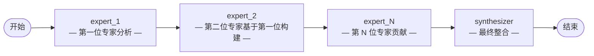

# 专家链模式 (Chain-of-Experts Pattern)

> **任务在专家 Agent 间依次传递，每个专家在前一位的基础上添加自己的分析。**

专家链模式将任务依次传递给一系列专业专家 Agent，每个专家在之前专家的基础上添加自己的分析视角。最后由综合器整合所有专家贡献，形成完整输出。

这种模式非常适合需要多个领域视角的复杂任务，每个专家的分析都为下一个专家提供上下文。

---

## 适用场景

| 适合使用 | 不适合使用 |
|----------|-----------|
| 需要多个领域专家审查的复杂研究 | 简单的单一领域任务 |
| 需要顺序专家审查的文档编辑 | 需要并行处理以提高速度的任务 |
| 每个专家在前一个基础上构建的多阶段分析 | 有唯一正确答案的任务 |
| 法律、医疗或技术审查流程 | 需要即时响应的场景 |

---

## 架构



**状态 (State)** 在图中流转：

| 字段 | 类型 | 说明 |
|------|------|------|
| `task` | `str` | 输入任务 |
| `experts` | `list[dict]` | 专家定义列表 [{name, specialty, system_prompt}] |
| `current_expert_index` | `int` | 当前处理的专家索引 |
| `expert_outputs` | `list[dict]` | 每个专家的累积输出 |
| `final_synthesis` | `str` | 综合器的最终整合输出 |

---

## 核心代码

```python
from patterns.chain_of_experts.pattern import ChainOfExpertsPattern

pattern = ChainOfExpertsPattern()

experts = [
    {"name": "法律审查", "specialty": "法律分析"},
    {"name": "技术专家", "specialty": "技术可行性"},
    {"name": "风险分析师", "specialty": "风险评估"},
]

result = pattern.run(
    task="审查这份软件合作协议",
    experts=experts,
)

print(result["final_synthesis"])  # 整合后的专家分析
```

### 配置参数

| 参数 | 默认值 | 说明 |
|------|--------|------|
| `model` | `"gpt-4o-mini"` | OpenAI 模型名称（提供 `llm` 时忽略） |
| `llm` | `None` | 预配置的 LangChain `BaseChatModel` 实例 |

---

## 快速开始

```bash
# 1. 克隆并安装依赖
git clone https://github.com/your-org/agentflow.git
cd agentflow && uv sync

# 2. 配置 API Key
echo "OPENAI_API_KEY=sk-..." > .env

# 3. 运行示例
uv run python -m patterns.chain_of_experts.example
```

---

## 示例输出

```
============================================================
CHAIN-OF-EXPERTS PATTERN -- 多专家分析
============================================================

任务：分析拟议的软件合作伙伴协议

专家 1: 法律审查
专家 2: 技术专家
专家 3: 风险分析师

============================================================
最终综合分析：
============================================================
# 综合合作伙伴分析

## 法律视角
[法律审查员对合同条款的分析...]

## 技术可行性
[技术专家的评估...]

## 风险评估
[风险分析师的评价...]

## 整合结论
[综合三位专家的发现...]

============================================================
专家贡献数：3
```

---

## 工作原理详解

1. **初始化：** 图接收一个任务和专家定义列表。
2. **专家处理：** 每个专家按顺序处理任务，接收所有先前专家输出的上下文。
3. **顺序传递：** 专家 1 → 专家 2 → ... → 专家 N，每个都在前一个基础上构建。
4. **综合：** 最终综合器节点将所有专家输出整合成连贯的结论。
5. **输出：** 图返回反映所有专家视角的完整综合分析。

---

## 与其他模式的对比

| 维度 | 专家链模式 | 反思模式 | 辩论模式 |
|------|----------|---------|---------|
| **Agent 数量** | N 个专家 + 1 个综合器 | 2（写作 + 评审） | 2+ 个对抗性辩手 |
| **交互方式** | 顺序链式传递 | 顺序循环 | 对抗式多轮 |
| **最佳场景** | 多领域分析 | 迭代改进 | 探索对立观点 |
| **输出** | 整合综合分析 | 改进后的草稿 | 输赢判定 |
| **实现复杂度** | 中等 | 低 | 中等 |

专家链模式非常适合需要多个专业视角且相互构建的场景。需要单一输出迭代改进时使用反思模式。需要探索对立观点时使用辩论模式。

---

## 运行测试

```bash
uv run pytest patterns/chain_of_experts/tests/ -v
```

测试使用 Mock LLM，无需 API Key。

---

## 文件结构

```
patterns/chain_of_experts/
├── __init__.py
├── pattern.py          # 核心 ChainOfExpertsPattern 类
├── example.py          # 一键可运行的演示
├── diagram.mmd         # Mermaid 架构图源文件
├── README.md           # 英文文档
├── README_zh.md        # 本文件（中文文档）
└── tests/
    ├── __init__.py
    └── test_chain_of_experts.py
```
