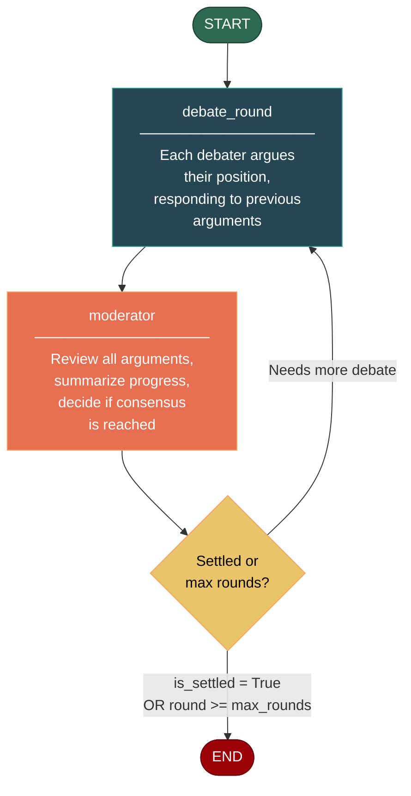

# Debate Pattern

Multi-perspective deliberation with moderator synthesis. N agents argue from distinct viewpoints; a moderator reviews each round and decides when consensus is reached or the maximum rounds are exhausted.

## When to Use

- **Investment decisions**: Bull vs. Bear on a deal, architecture trade-offs, hiring choices.
- **Policy analysis**: Stress-test a proposal by having agents argue for and against.
- **Product planning**: Explore conflicting user needs or feature priorities.
- **Research synthesis**: Aggregate conflicting findings from multiple studies.

## When NOT to Use

- **Only one reasonable answer**: Debates are noisy; don't use them when a deterministic function suffices.
- **Time-critical decisions**: Each round costs N LLM calls. If latency matters, use MapReduce.
- **Emotional or personal topics**: LLMs may surface stereotypes or produce manipulative rhetoric.
- **Large N without grouping**: 10+ debaters overwhelm a single moderator. Use MapReduce to cluster first.

---

## Architecture



The graph has two node types:

1. **debate_round** — For each debater, injects their system prompt + the full debate history into the LLM and collects the response.
2. **moderator** — Feeds the entire transcript to a moderator LLM, which outputs a structured response with `SUMMARY`, `STATUS` (SETTLED/CONTINUE), and optionally `DECISION`.

The conditional edge from `moderator` routes back to `debate_round` or terminates based on `is_settled` and `current_round`.

---

## Core Code

```python
from patterns.debate.pattern import DebatePattern

debaters = [
    {
        "name": "Bull",
        "role": "Optimistic investor",
        "system_prompt": "You are Bull, an optimistic tech investor...",
    },
    {
        "name": "Bear",
        "role": "Cautious risk analyst",
        "system_prompt": "You are Bear, a cautious risk analyst...",
    },
]

pattern = DebatePattern(max_rounds=3)
result = pattern.run(
    topic="Should we invest $1M in an AI startup at a $50M valuation?",
    debaters=debaters,
)

print(result["final_decision"])
print(result["debate_history"])
```

### State

```python
class DebateState(TypedDict):
    topic: str
    debaters: list[dict]              # [{name, role, system_prompt}]
    current_round: int
    max_rounds: int
    debate_history: Annotated[list[dict], operator.add]
    moderator_summary: str
    final_decision: str
    is_settled: bool
```

### Key Design Decisions

- **Annotated list with `operator.add`**: The `debate_history` key uses LangGraph's `Annotated[..., operator.add]` pattern so each node appends new arguments without overwriting previous rounds.
- **Moderator parses its own output**: The moderator must emit `SUMMARY:`, `STATUS:`, and `DECISION:` lines. The pattern extracts these via `_extract_section`.
- **Moderator controls settlement**: Settlement is not automatic — the moderator LLM decides based on argument quality and consensus.

---

## Configuration Options

| Parameter | Type | Default | Description |
|-----------|------|---------|-------------|
| `model` | `str` | `"gpt-4o-mini"` | OpenAI model name |
| `llm` | `BaseChatModel \| None` | `None` | Custom LLM (overrides `model`) |
| `max_rounds` | `int` | `3` | Maximum debate rounds before forced end |

---

## Quick Start

```bash
# Install dependencies
cd agentflow
cp .env.example .env
# Add OPENAI_API_KEY to .env

# Run the example
python -m patterns.debate.example
```

---

## Example Output

```
============================================================
DEBATE PATTERN — Investment Decision
============================================================

------------------------------------------------------------
  ROUND 1
------------------------------------------------------------

  [Bull  —  Optimistic investor]
  ........................................

  Bull opens with a bullish case: AI is on a Moore's Law trajectory...
  The $50M valuation represents a 5x revenue multiple vs. 50x for
  public SaaS companies...

  [Bear  —  Cautious risk analyst]
  ........................................

  Bear counters with cash-burn data: the average AI startup burns
  $2M/month in API costs alone. Without path to positive unit
  economics, this is a pure growth gamble...

------------------------------------------------------------
  ROUND 2
------------------------------------------------------------

  [Bull  —  Optimistic investor]
  ........................................

  Bull acknowledges the burn rate but points to the $10M ARR
  contract just signed with a Fortune 500, and the proprietary
  fine-tuning pipeline that creates a 2-year defensibility window...

============================================================
  MODERATOR SUMMARY
============================================================

  SUMMARY: Bull has provided concrete evidence of traction
  (Fortune 500 contract, proprietary pipeline). Bear has raised
  valid concerns about burn rate and market timing, but has not
  addressed the moat question. A third round is warranted to
  explore the go-to-market strategy.

  STATUS: CONTINUE

============================================================
  ROUND 3
------------------------------------------------------------

  [Bull  —  Optimistic investor]
  [Bear  —  Cautious risk analyst]

============================================================
  MODERATOR SUMMARY
============================================================

  SUMMARY: After three full rounds, both sides have articulated
  their positions. Bull has demonstrated traction and a defensible
  pipeline. Bear has shown that market timing and burn rate remain
  material risks. A clear synthesis is now possible.

  STATUS: SETTLED
  DECISION: Allocate $500K (50% of planned investment) as an
  initial tranche tied to milestones (reaching $20M ARR and
  reducing monthly burn to under $500K). Reserve the remaining
  $500K for a follow-on round if milestones are met.

============================================================
  FINAL DECISION
============================================================

  Allocate $500K as a milestone-based initial tranche; reserve
  the remaining $500K for a follow-on investment contingent on
  reaching $20M ARR and sub-$500K/month burn rate.

============================================================
  Debate concluded after 3 round(s)
  Settled by consensus: True
============================================================
```

---

## Comparison with Other Patterns

| | **Debate** | **Reflection** | **MapReduce** |
|---|---|---|---|
| **Agents** | N debaters + moderator | 1 writer + 1 reviewer | 1 mapper orchestrator + N mappers + 1 reducer |
| **Flow** | Looping until settled or max rounds | Looping until quality threshold | Fan-out, then reduce |
| **Best for** | Adversarial reasoning, multi-perspective synthesis | Iterative self-improvement | Large-scale parallel processing |
| **LLM calls per round** | N + 1 (debaters + moderator) | 2 (write + review) | N mappers + 1 reducer |
| **Settlement** | Moderator decides | Reviewer quality score | Reducer produces final output |

Use **Reflection** when you need a single agent to improve through iteration. Use **MapReduce** when you need to process many independent items in parallel. Use **Debate** when you need structured adversarial reasoning between distinct perspectives.

---

## Files

```
patterns/debate/
├── __init__.py          # Empty
├── pattern.py           # DebatePattern class + prompts
├── example.py           # Investment decision example
├── diagram.mmd          # Mermaid source
├── README.md            # This file
└── tests/
    ├── __init__.py
    └── test_debate.py   # 15+ test cases
```
