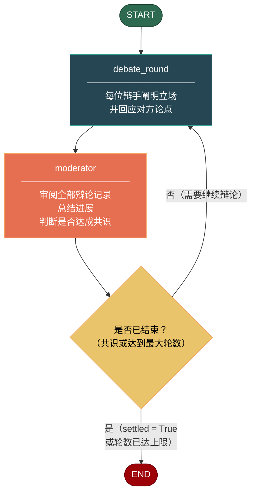

# 辩论模式（Debate Pattern）

多视角论证与主持人综合。N 个智能体各自从不同立场展开辩论；一位主持人逐轮审阅所有论点，判断是否已达成共识，或在达到最大轮数后强制结束辩论。

## 适用场景

- **投资决策**：多空双方就一笔交易展开论证，架构选型争议，招聘决策等。
- **政策分析**：通过正反方辩论来"压力测试"一项提案。
- **产品规划**：探索相互冲突的用户需求或功能优先级。
- **研究综述**：对多项相互矛盾的研究结论进行系统性整合。

## 不适用场景

- **答案唯一且确定**：辩论天然带有噪声，如果一个确定性函数就能解决问题，无需引入辩论。
- **时间敏感的决策**：每轮辩论需要 N 次 LLM 调用，延迟较高。若延迟是硬性要求，请使用 MapReduce 模式。
- **情感或个人话题**：LLM 可能产生刻板印象或操控性话术。
- **辩手数量过多（10+）**：单一主持人无法有效处理大量辩手。请先用 MapReduce 做分组。

---

## 架构



图中有两类节点：

1. **debate_round** — 遍历所有辩手，将各自的 system prompt 与完整辩论历史注入 LLM，收集各辩手的回应。
2. **moderator** — 将完整辩论记录喂给主持人 LLM，输出结构化结果：包含 `SUMMARY`（总结）、`STATUS`（SETTLED/CONTINUE）以及可选的 `DECISION`（最终裁决）。

从 `moderator` 出发的条件边根据 `is_settled` 和 `current_round` 决定是回到 `debate_round` 还是终止。

---

## 核心代码

```python
from patterns.debate.pattern import DebatePattern

debaters = [
    {
        "name": "Bull",
        "role": "乐观派投资者",
        "system_prompt": "你是 Bull，一位乐观的科技投资者坚信 AI 将重塑所有行业...",
    },
    {
        "name": "Bear",
        "role": "谨慎风险分析师",
        "system_prompt": "你是 Bear，一位有 20 年经验的风险分析师，经历过互联网泡沫...",
    },
]

pattern = DebatePattern(max_rounds=3)
result = pattern.run(
    topic="是否应该以 5000 万美元估值向一家 AI 初创公司投资 100 万美元？",
    debaters=debaters,
)

print(result["final_decision"])
print(result["debate_history"])
```

### 状态定义

```python
class DebateState(TypedDict):
    topic: str
    debaters: list[dict]              # [{name, role, system_prompt}]
    current_round: int
    max_rounds: int
    debate_history: Annotated[list[dict], operator.add]
    moderator_summary: str
    final_decision: str
    is_settled: bool
```

### 关键设计决策

- **`Annotated[..., operator.add]`**：辩论历史使用 LangGraph 的 `Annotated` + `operator.add` 注解模式，每轮辩论追加新论点而不覆盖之前的内容。
- **主持人自解析输出**：主持人 LLM 必须输出 `SUMMARY:`、`STATUS:`、`DECISION:` 三行。模式通过 `agentflow.utils` 中的 `extract_section` 提取各字段。
- **共识由主持人决定**：是否"达成共识"不是自动判断的，而是主持人根据论点质量和共识程度自主决定。

---

## 配置参数

| 参数 | 类型 | 默认值 | 说明 |
|------|------|--------|------|
| `model` | `str` | `"gpt-4o-mini"` | OpenAI 模型名 |
| `llm` | `BaseChatModel \| None` | `None` | 自定义 LLM（传入后覆盖 `model`） |
| `max_rounds` | `int` | `3` | 最大辩论轮数，超出后强制结束 |

---

## 快速开始

```bash
# 安装依赖
cd agentflow
cp .env.example .env
# 在 .env 中填入 OPENAI_API_KEY

# 运行示例
python -m patterns.debate.example
```

---

## 示例输出

```
============================================================
DEBATE PATTERN — Investment Decision
============================================================

------------------------------------------------------------
  ROUND 1
------------------------------------------------------------

  [Bull  —  乐观派投资者]
  ........................................

  Bull 开门见山：AI 正在沿摩尔定律的轨迹快速发展，$50M 的估值
  相对于未来万亿级市场而言是白菜价。他引用了 OpenAI、DeepMind
  的早期投资回报案例，并强调了创始团队在 Transformer 架构上的
  深厚积累...

  [Bear  —  谨慎风险分析师]
  ........................................

  Bear 冷静回应：当前 AI 市场已严重过热。大多数 $50M 估值的初创
  公司月烧钱 $200 万，仅靠 API 调用收入无法覆盖成本。他引用了
  去年 3 家 AI 明星公司的倒闭案例，指出技术优势不等于商业护城河...

------------------------------------------------------------
  ROUND 2
------------------------------------------------------------

  [Bull  —  乐观派投资者]
  ........................................

  Bull 承认烧钱风险，但带来了新证据：刚刚与财富 500 强签订了
  $1000 万 ARR 合同，且自研的微调流水线可在未来 2 年内形成
  技术壁垒。他要求 Bear 正面回应这份合同的意义...

============================================================
  MODERATOR SUMMARY
============================================================

  SUMMARY: Bull 提供了 traction 的具体证据（财富 500 强合同、
  专有流水线）。Bear 的烧钱担忧是合理的，但尚未回应合同问题。
  第三轮应该聚焦于市场竞争格局和退出路径。

  STATUS: CONTINUE

============================================================
  ROUND 3
------------------------------------------------------------

  [Bull  —  乐观派投资者]
  [Bear  —  谨慎风险分析师]

============================================================
  MODERATOR SUMMARY
============================================================

  SUMMARY: 经过三轮完整辩论，双方都已充分表达立场。
  Bull 证明了 traction 和技术壁垒；Bear 揭示了市场时机和
  现金流风险。现在可以形成清晰的综合判断。

  STATUS: SETTLED
  DECISION: 建议分阶段投资：先投入 50 万美元作为初始 tranche，
  与里程碑挂钩（$20M ARR 且月烧钱降至 $50 万以下时，
  再注入剩余 50 万美元）。若里程碑未达成，则止损退出。

============================================================
  FINAL DECISION
============================================================

  建议分阶段投资：先投入 50 万美元作为初始 tranche，与里程碑
  挂钩（$20M ARR 且月烧钱降至 $50 万以下时，再注入剩余 50 万
  美元）。若里程碑未达成，则止损退出。

============================================================
  Debate concluded after 3 round(s)
  Settled by consensus: True
============================================================
```

---

## 与其他模式的对比

| | **辩论（Debate）** | **反思（Reflection）** | **MapReduce** |
|---|---|---|---|
| **智能体数量** | N 个辩手 + 1 个主持人 | 1 个写手 + 1 个评审 | 1 个 mapper 编排器 + N 个 mapper + 1 个 reducer |
| **流程特点** | 循环直至共识或达到最大轮数 | 循环直至质量阈值 | 先并行展开，再归并 |
| **最佳用途** | 对抗性推理、多视角综合 | 单一智能体的迭代自我改进 | 大规模并行处理 |
| **每轮 LLM 调用次数** | N + 1（辩手 + 主持人） | 2（写 + 评） | N 个 mapper + 1 个 reducer |
| **结束条件** | 主持人判断共识达成 | 评审质量分数达标 | Reducer 产出最终结果 |

当你需要**单一智能体通过迭代不断提升质量**时使用反思模式；当你需要**并行处理大量独立任务**时使用 MapReduce 模式；当你需要**不同立场之间的结构化对抗性推理**时使用辩论模式。

---

## 文件清单

```
patterns/debate/
├── __init__.py          # 空文件
├── pattern.py           # DebatePattern 类 + 系统提示词
├── example.py           # 投资决策示例
├── diagram.mmmd          # Mermaid 源文件
├── README.md            # 英文文档
├── README_zh.md         # 本文件（中文文档）
└── tests/
    ├── __init__.py
    └── test_debate.py   # 15+ 个测试用例
```
