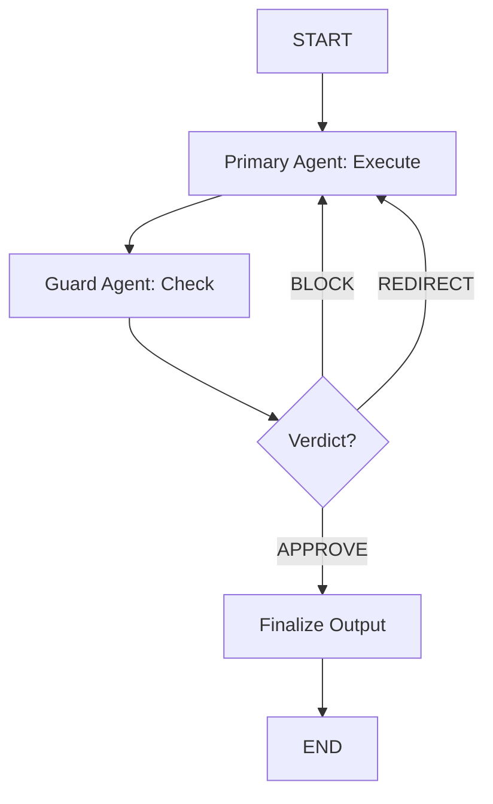

# GuardRail Pattern

> A primary agent executes a task, then a safety guard reviews the output and approves, blocks, or redirects it. If blocked or redirected, the primary retries with specific feedback.

## When to Use

- **Content moderation** where harmful or inappropriate output must be caught before delivery
- **Code generation** with security review (prevent SQL injection, XSS, etc.)
- **Financial or legal output** requiring compliance verification
- **High-stakes decisions** where a second opinion is mandatory
- **User-facing applications** where quality and safety cannot be compromised

## When NOT to Use

- **Iterative refinement** — if you need ongoing quality improvement, use Reflection instead
- **Low-stakes content** — the guard overhead is not worth it for casual outputs
- **Simple transformations** — no need for a guard on straightforward, predictable tasks
- **Real-time streaming** — the guard checkpoint introduces latency

## Architecture



## Key Concepts

The **GuardRail Pattern** is preventive, not corrective. Unlike **Reflection** which iteratively improves output through review-rewrite cycles, GuardRail operates as a checkpoint: execute once, review once, decide once.

The guard agent makes a ternary decision:
- **APPROVE**: Output passes review, proceed to finalization
- **BLOCK**: Serious violation detected, primary must retry with corrections
- **REDIRECT**: Minor issues, primary should retry with guidance

The key distinction from **Reflection**:
- Reflection: `write → review → rewrite → review → rewrite → ...` (iterative, quality-focused)
- GuardRail: `execute → guard → APPROVE/BLOCK/REDIRECT → END or retry` (checkpoint, safety-focused)

## Quick Start

```bash
cd patterns/guardrail
python example.py
```

## Core Code

```python
def _should_continue(self, state: GuardRailState) -> str:
    """Route based on guard verdict and attempt count."""
    if state["guard_verdict"] == "approve":
        return "approve"
    if state["attempts"] >= state.get("max_attempts", self.max_attempts):
        return "max_attempts"
    return state["guard_verdict"]
```

## How It Works

1. **Primary Execute**: Primary agent generates output for the given task
2. **Guard Check**: Guard agent reviews output and returns verdict + feedback
3. **Routing**: Based on verdict and attempt count, either finalize or retry
4. **Finalize**: Output is accepted as final

## Configuration

| Parameter | Default | Description |
|-----------|---------|-------------|
| `model` | `gpt-4o-mini` | LLM model name |
| `llm` | `None` | Pre-configured LLM instance |
| `max_attempts` | `3` | Maximum execution attempts before forcing acceptance |

## Comparison with Other Patterns

| Aspect | GuardRail | Reflection | Debate |
|--------|-----------|------------|--------|
| Purpose | Safety checkpoint | Quality improvement | Conflict resolution |
| Iteration | Checkpoint (1 retry) | Iterative loop | Multi-round |
| Review type | Binary/ternary verdict | Quality score | Arguments |
| Trigger | Every execution | Low quality score | Probing |
| Best for | High-stakes output | Writing refinement | Adversarial exploration |
