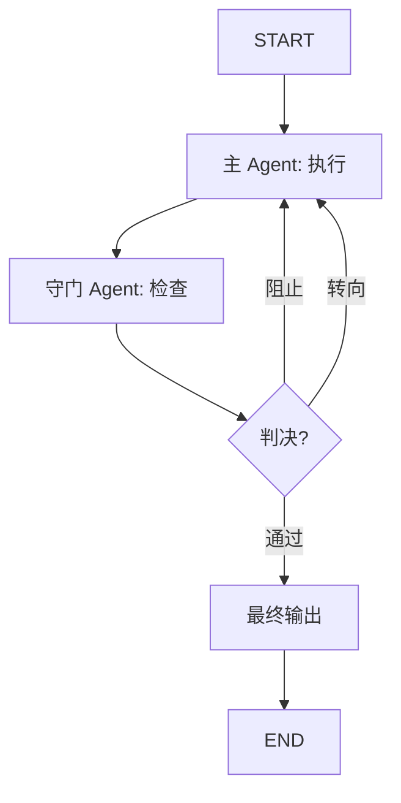

# GuardRail Pattern（风控守门模式）

> 主 Agent 执行任务，然后安全门 Agent 审查输出并决定：通过（APPROVE）、阻止（BLOCK）或转向（REDIRECT）。如果被阻止或转向，主 Agent 收到具体反馈并重试。

## 适用场景

- **内容审核**——必须在发布前拦截有害或不适当的内容
- **代码生成**——需要安全审查（防止 SQL 注入、XSS 等）
- **金融或法律输出**——需要合规验证
- **高风险决策**——必须有第二意见
- **面向用户的应用**——质量和安全不能妥协

## 不适用场景

- **迭代改进**——如果需要持续的质量提升，使用 Reflection 模式
- **低风险内容**——对于随意输出，guard 的开销不划算
- **简单转换**——对直接可预测的任务不需要守门
- **实时流式输出**——守门检查点会引入延迟

## 架构图



## 核心概念

**GuardRail Pattern** 是预防性的，不是纠正性的。与 **Reflection** 的区别：Reflection 通过评审-重写循环迭代改进输出；GuardRail 作为检查点运行：执行一次，审查一次，决定一次。

守门 Agent 做三元判决：
- **APPROVE（通过）**：输出通过审查，进入最终确认
- **BLOCK（阻止）**：检测到严重违规，主 Agent 必须重试
- **REDIRECT（转向）**：有小问题，主 Agent 应按指导重试

与 **Reflection** 的关键区别：
- Reflection：`写 → 评审 → 重写 → 评审 → 重写 → ...`（迭代，质量导向）
- GuardRail：`执行 → 守门 → APPROVE/BLOCK/REDIRECT → END 或重试`（检查点，安全导向）

## 快速开始

```bash
cd patterns/guardrail
python example.py
```

## 核心代码

```python
def _should_continue(self, state: GuardRailState) -> str:
    """基于守门判决和尝试次数进行路由"""
    if state["guard_verdict"] == "approve":
        return "approve"
    if state["attempts"] >= state.get("max_attempts", self.max_attempts):
        return "max_attempts"
    return state["guard_verdict"]
```

## 工作流程

1. **主 Agent 执行**：主 Agent 为给定任务生成输出
2. **守门检查**：守门 Agent 审查输出并返回判决 + 反馈
3. **路由**：根据判决和尝试次数，或者最终确认或者重试
4. **最终确认**：输出被接受为最终结果

## 配置参数

| 参数 | 默认值 | 说明 |
|------|--------|------|
| `model` | `gpt-4o-mini` | LLM 模型名称 |
| `llm` | `None` | 预配置的 LLM 实例 |
| `max_attempts` | `3` | 强制接受前的最大执行尝试次数 |

## 与其他模式对比

| 维度 | GuardRail | Reflection | Debate |
|------|-----------|------------|--------|
| 目的 | 安全检查点 | 质量提升 | 冲突解决 |
| 迭代方式 | 检查点（1次重试） | 迭代循环 | 多轮 |
| 审查类型 | 二元/三元判决 | 质量评分 | 辩论 |
| 触发条件 | 每次执行 | 低质量分数 | 探测 |
| 最佳场景 | 高风险输出 | 写作改进 | 对抗性探索 |
