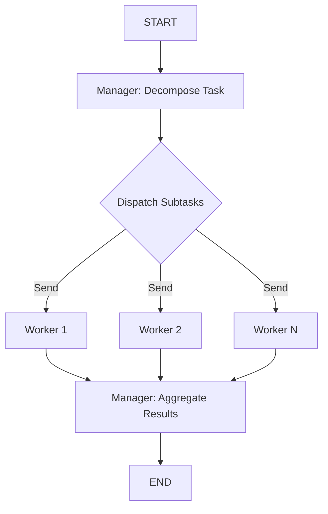

# Hierarchical Pattern

> A Manager agent decomposes complex tasks into subtasks for parallel Worker agents, then synthesizes their findings into a cohesive output.

## When to Use

- **Complex, multi-faceted research** that requires different specialized perspectives (market analysis, technical analysis, competitive landscape)
- **Business decision analysis** with distinct dimensions (risk, opportunity, regulatory, financial)
- **Content generation** requiring diverse expertise (data analysis + creative writing + technical explanation)
- **Distributed problem-solving** where subtasks can be fully independent

## When NOT to Use

- **Simple, single-dimension tasks** — the overhead of decomposition and aggregation is not worth it
- **Tightly coupled subtasks** where one worker's output influences another's — use Debate or Reflection instead
- **Tasks requiring negotiation** between workers — use Debate pattern
- **Real-time streaming responses** needed — the aggregation step requires all workers to complete first

## Architecture



## Key Concepts

The **Hierarchical Pattern** is built around a Manager-Worker architecture. The Manager acts as an orchestrator: it decomposes a complex task into independent subtasks, fans them out to Worker agents running in parallel, and then synthesizes all results into a final output.

Unlike **MapReduce**, where workers are stateless mappers doing one-shot analysis, Hierarchical workers are complete reasoning agents with their own internal state. The Manager performs recursive task decomposition, not just simple dispatch.

Unlike **Debate**, where agents argue back and forth evolving positions, Hierarchical workers operate independently and their outputs do not influence one another — the aggregation happens only at the Manager level after all workers complete.

The pattern is particularly powerful when:
1. The task has natural dimensions that can be studied independently
2. You have domain expertise distributed across different areas
3. You want to parallelize work but maintain centralized quality control

## Quick Start

```bash
cd patterns/hierarchical
python example.py
```

## Core Code

```python
class HierarchicalPattern:
    def __init__(self, model=None, llm=None):
        self.llm = llm or _default_llm(model)
        self._worker_graph = self._build_worker_graph()

    def _dispatch(self, state: HierarchicalState) -> list[Send]:
        """Fan-out: emit one Send per subtask so each worker runs in parallel."""
        return [
            Send("worker_invoker", {
                "task_id": subtask["task_id"],
                "subtask": subtask["objective"],
            })
            for subtask in state["decomposed_tasks"]
        ]
```

## How It Works

1. **Manager Decompose**: The Manager receives the main task and decomposes it into 3-5 independent subtasks with clear objectives
2. **Dispatch**: The graph fans out one `Send` per subtask to worker nodes running in parallel
3. **Worker Execution**: Each Worker agent independently analyzes its subtask and produces a detailed result
4. **Manager Aggregate**: Once all workers complete, the Manager synthesizes all results into a cohesive final report

## Configuration

| Parameter | Default | Description |
|-----------|---------|-------------|
| `model` | `gpt-4o-mini` | LLM model name |
| `llm` | `None` | Pre-configured LLM instance |
| `num_workers` | `3` | Hint for decomposition (actual number determined by Manager) |

## Comparison with Other Patterns

| Aspect | Hierarchical | MapReduce | Debate | Reflection |
|--------|-------------|-----------|--------|-----------|
| Worker type | Reasoning agents | Stateless mappers | Adversarial arguer | Iterative improver |
| Worker interdependency | None | None | Direct debate | Feedback loop |
| Number of rounds | 1 (parallel) | 1 (parallel) | Multiple | Multiple |
| Aggregation | Manager synthesis | Reducer | Moderator | Self-review |
| Best for | Multi-dimension research | Multi-source analysis | Conflict resolution | Quality improvement |

## Example Output

```
Original Task: Analyze the current state of the AI industry...

Decomposed into 4 subtasks:
  - [subtask_0] Technology Trends Analysis
  - [subtask_1] Market Dynamics and Investment
  - [subtask_2] Competitive Landscape
  - [subtask_3] Regulatory Environment

Worker Results:
  >>> [subtask_0] Technology Trends Analysis
      Key Findings: Transformer architecture continues to dominate...

  >>> [subtask_1] Market Dynamics and Investment
      Key Findings: VC funding in AI reached $18B in Q3...

Final Synthesis (Manager Aggregate):
  ## AI Industry Analysis: Comprehensive Synthesis

  ### Technology Landscape
  The transformer architecture remains the dominant paradigm...
```
