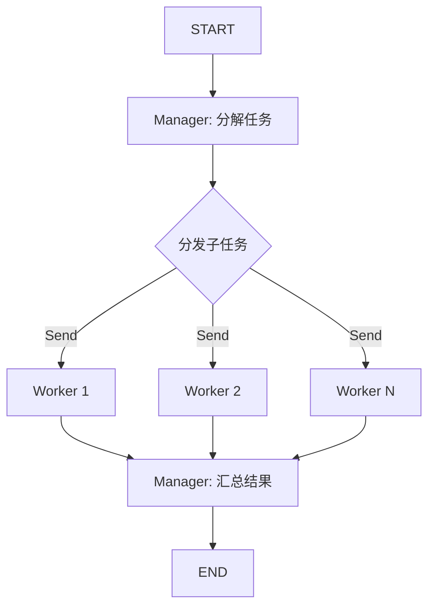

# Hierarchical Pattern（层级委派模式）

> Manager Agent 将复杂任务分解为子任务，并行分发给 Worker Agents 执行，最后汇总所有结果形成完整输出。

## 适用场景

- **复杂、多维度的研究任务**——需要不同专业视角（市场分析、技术分析、竞争格局）
- **商业决策分析**——涵盖风险、机会、监管、财务等多个维度
- **需要多元专业知识的內容生成**——数据分析 + 创意写作 + 技术说明
- **分布式问题求解**——子任务可以完全独立执行

## 不适用场景

- **简单、单维度任务**——分解和汇总的开销不划算
- **紧密耦合的子任务**——某个 Worker 的输出会影响另一个的工作——改用 Debate 或 Reflection
- **需要 Worker 之间协商的任务**——使用 Debate 模式
- **需要实时流式输出的任务**——汇总步骤需要所有 Worker 完成后才能进行

## 架构图



## 核心概念

**Hierarchical Pattern（层级委派模式）** 以 Manager-Worker 架构为核心。Manager 充当协调者：将复杂任务分解为独立子任务，并行分发给 Worker Agents 运行，最后将所有结果综合成最终输出。

与 **MapReduce** 的区别：MapReduce 的 Worker 是无状态的映射器，做一次性分析；Hierarchical 的 Worker 是完整的推理 Agent，有自己的内部状态。Manager 执行递归任务分解，而不仅仅是简单分发。

与 **Debate** 的区别：Debate 中 Agent 之间来回辩论，立场相互影响；Hierarchical 的 Worker 完全独立运行，输出互不影响——聚合只在 Manager 层面进行。

适用场景：
1. 任务有自然的可独立研究的维度
2. 专业知识分布在不同领域
3. 需要并行化工作但保持集中质量控制

## 快速开始

```bash
cd patterns/hierarchical
python example.py
```

## 核心代码

```python
class HierarchicalPattern:
    def __init__(self, model=None, llm=None):
        self.llm = llm or _default_llm(model)
        self._worker_graph = self._build_worker_graph()

    def _dispatch(self, state: HierarchicalState) -> list[Send]:
        """分发：一个 Send 对应一个子任务，并行执行"""
        return [
            Send("worker_invoker", {
                "task_id": subtask["task_id"],
                "subtask": subtask["objective"],
            })
            for subtask in state["decomposed_tasks"]
        ]
```

## 工作流程

1. **Manager 分解**：Manager 接收主任务，将其分解为 3-5 个有清晰目标的独立子任务
2. **分发**：图按子任务数量 fan-out，每个子任务通过 `Send` 并行发送到 Worker 节点
3. **Worker 执行**：每个 Worker Agent 独立分析其子任务并产出详细结果
4. **Manager 汇总**：所有 Worker 完成后，Manager 将所有结果综合成一份完整的报告

## 配置参数

| 参数 | 默认值 | 说明 |
|------|--------|------|
| `model` | `gpt-4o-mini` | LLM 模型名称 |
| `llm` | `None` | 预配置的 LLM 实例 |
| `num_workers` | `3` | 分解提示（实际数量由 Manager 决定） |

## 与其他模式对比

| 维度 | Hierarchical | MapReduce | Debate | Reflection |
|------|-------------|-----------|--------|-----------|
| Worker 类型 | 推理 Agent | 无状态映射器 | 对抗性辩手 | 迭代改进器 |
| Worker 依赖 | 无 | 无 | 直接辩论 | 反馈循环 |
| 轮数 | 1（并行） | 1（并行） | 多轮 | 多轮 |
| 聚合方式 | Manager 综合 | Reducer | Moderator | 自我评审 |
| 最佳场景 | 多维度研究 | 多源分析 | 冲突解决 | 质量提升 |

## 示例输出

```
原始任务：分析 AI 行业现状...

分解为 4 个子任务：
  - [subtask_0] 技术趋势分析
  - [subtask_1] 市场动态与投资
  - [subtask_2] 竞争格局
  - [subtask_3] 监管环境

Worker 结果：
  >>> [subtask_0] 技术趋势分析
      关键发现：Transformer 架构持续主导...

  >>> [subtask_1] 市场动态与投资
      关键发现：VC 在 AI 领域投资达 180 亿美元...

最终综合报告（Manager 汇总）：
  ## AI 行业分析：综合报告

  ### 技术格局
  Transformer 架构仍是主导范式...
```
