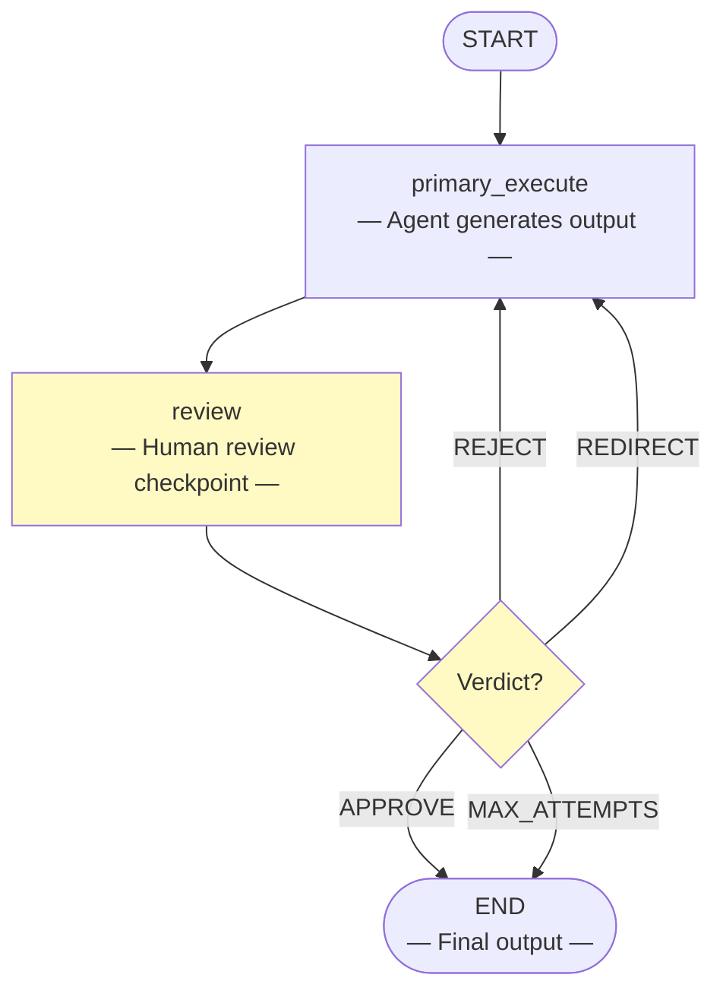

# Human-in-the-Loop Pattern

> **Agent execution with human approval checkpoints for critical decisions.**

The Human-in-the-Loop pattern runs a primary agent that executes a task, then pauses at a review checkpoint for human approval. The human can approve the output, reject it for a complete redo, or redirect with specific feedback.

This pattern is essential for high-stakes applications where human oversight is required before final actions — legal, financial, medical, or any domain where errors have serious consequences.

---

## When to Use

| Good fit | Poor fit |
|----------|----------|
| High-stakes decisions requiring human approval | Low-risk, high-volume tasks |
| Content that needs editorial review before publishing | Real-time systems where latency is critical |
| Tasks where domain expertise supplements AI | Fully automated workflows |
| Compliance-required human sign-off | Creative tasks where speed matters most |

---

## Architecture



**State** flows through the graph:

| Field | Type | Description |
|-------|------|-------------|
| `task` | `str` | The input task |
| `primary_output` | `str` | Agent's generated output |
| `human_verdict` | `str` | "approve", "reject", "redirect", or "" |
| `human_feedback` | `str` | Feedback from human reviewer |
| `attempts` | `int` | Number of execution attempts |
| `max_attempts` | `int` | Maximum allowed attempts |
| `final_output` | `str` | Final approved output |

---

## Core Code

```python
from patterns.human_in_the_loop.pattern import HumanInTheLoopPattern

pattern = HumanInTheLoopPattern(max_attempts=3)

result = pattern.run(
    task="Write a formal apology letter to our customers",
    max_attempts=3,
)

# In real use, the verdict comes from actual human review
print(result["final_output"])
print(result["human_verdict"])
```

### Configuration Options

| Parameter | Default | Description |
|-----------|---------|-------------|
| `model` | `"gpt-4o-mini"` | OpenAI model name (ignored when `llm` is provided) |
| `llm` | `None` | Pre-configured LangChain `BaseChatModel` instance |
| `max_attempts` | `3` | Maximum execute → review cycles |

---

## Quick Start

```bash
# 1. Clone and install
git clone https://github.com/your-org/agentflow.git
cd agentflow && uv sync

# 2. Set your API key
echo "OPENAI_API_KEY=sk-..." > .env

# 3. Run the example
uv run python -m patterns.human_in_the_loop.example
```

---

## Verdict Types

| Verdict | Meaning | Action |
|---------|---------|--------|
| **APPROVE** | Output meets quality standards | Finalize and return |
| **REJECT** | Output is fundamentally wrong | Discard and restart |
| **REDIRECT** | Output needs specific changes | Revise with feedback |

---

## Example Output

```
============================================================
HUMAN-IN-THE-LOOP PATTERN -- Document Approval
============================================================

Task: Write a formal apology letter to customers
Max Attempts: 3

------------------------------------------------------------
Attempt 1:
Output: [Initial draft...]
Verdict: REDIRECT
Feedback: More specific about the issue, less bureaucratic

------------------------------------------------------------
Attempt 2:
Output: [Revised draft...]
Verdict: APPROVE

============================================================
FINAL OUTPUT:
============================================================
Dear Valued Customers,

We sincerely apologize for the service disruption you
experienced on March 15th. We understand this caused
inconvenience, and we are taking immediate steps to ensure
this does not happen again...

============================================================
Attempts: 2
Final Verdict: APPROVE
```

---

## How It Works — Step by Step

1. **Primary Execute:** The primary agent generates an initial output for the task.
2. **Review Checkpoint:** The graph pauses for human review. In simulation mode, an LLM evaluates the output.
3. **Verdict Routing:**
   - APPROVE → Finalize and return
   - REJECT → Go back to primary execute (discard output)
   - REDIRECT → Go back to primary execute with feedback
4. **Retry with Feedback:** On REJECT or REDIRECT, the primary agent receives feedback and attempts improvement.
5. **Max Attempts Guard:** After max_attempts, the output is finalized even if not approved.

---

## Comparison with Other Patterns

| Dimension | Human-in-the-Loop | Reflection | Chain-of-Experts |
|-----------|-------------------|------------|------------------|
| **Human role** | Approver/Reviewer | Reviewer (automated) | Not involved |
| **Output quality** | Human-controlled | Algorithmically improved | Multi-perspective |
| **Best for** | High-stakes approval | Iterative refinement | Expert analysis |
| **Latency** | High (waits for human) | Low (automated) | Medium |
| **Automation** | Partial | Full | Full |

Human-in-the-Loop is essential when human judgment is required before final output. Use Reflection for fully automated iterative improvement. Use Chain-of-Experts when multiple expert perspectives are needed without human oversight.

---

## Running Tests

```bash
uv run pytest patterns/human_in_the_loop/tests/ -v
```

Tests use mocked LLMs and require no API key.

---

## File Structure

```
patterns/human_in_the_loop/
├── __init__.py
├── pattern.py        # Core HumanInTheLoopPattern class
├── example.py        # One-click runnable demo
├── diagram.mmd       # Mermaid architecture diagram source
├── README.md         # This file (English)
├── README_zh.md      # Chinese documentation
└── tests/
    ├── __init__.py
    └── test_human_in_the_loop.py
```
