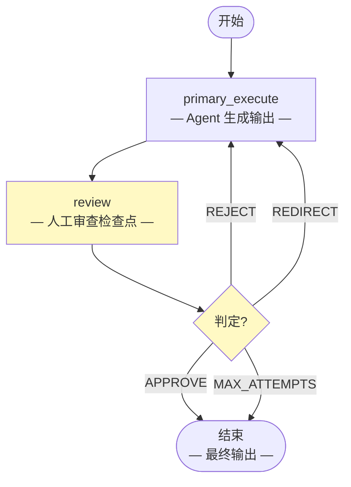

# 人机协作模式 (Human-in-the-Loop Pattern)

> **Agent 执行过程中设置人工审批检查点，用于关键决策。**

人机协作模式运行一个主 Agent 执行任务，然后在审查检查点暂停等待人工批准。人类可以批准输出、拒绝（完全重做）或重定向（提供反馈）。

这种模式对于高风险应用至关重要——法律、金融、医疗或任何错误后果严重的领域都需要人工监督。

---

## 适用场景

| 适合使用 | 不适合使用 |
|----------|-----------|
| 需要人工批准的高风险决策 | 低风险、高批量任务 |
| 发布前需要编辑审查的内容 | 延迟关键的实时系统 |
| 领域专业知识补充 AI 的任务 | 完全自动化的工作流 |
| 合规要求的人工签字 | 创意任务（速度优先） |

---

## 架构



**状态 (State)** 在图中流转：

| 字段 | 类型 | 说明 |
|------|------|------|
| `task` | `str` | 输入任务 |
| `primary_output` | `str` | Agent 生成的输出 |
| `human_verdict` | `str` | "approve"、"reject"、"redirect" 或 "" |
| `human_feedback` | `str` | 人工审查者的反馈 |
| `attempts` | `int` | 执行尝试次数 |
| `max_attempts` | `int` | 最大允许尝试次数 |
| `final_output` | `str` | 最终批准的输出 |

---

## 核心代码

```python
from patterns.human_in_the_loop.pattern import HumanInTheLoopPattern

pattern = HumanInTheLoopPattern(max_attempts=3)

result = pattern.run(
    task="写一封正式的客户道歉信",
    max_attempts=3,
)

# 实际使用时，判定结果来自真人审查
print(result["final_output"])
print(result["human_verdict"])
```

### 配置参数

| 参数 | 默认值 | 说明 |
|------|--------|------|
| `model` | `"gpt-4o-mini"` | OpenAI 模型名称（提供 `llm` 时忽略） |
| `llm` | `None` | 预配置的 LangChain `BaseChatModel` 实例 |
| `max_attempts` | `3` | 最大执行-审查循环次数 |

---

## 快速开始

```bash
# 1. 克隆并安装依赖
git clone https://github.com/your-org/agentflow.git
cd agentflow && uv sync

# 2. 配置 API Key
echo "OPENAI_API_KEY=sk-..." > .env

# 3. 运行示例
uv run python -m patterns.human_in_the_loop.example
```

---

## 判定类型

| 判定 | 含义 | 动作 |
|------|------|------|
| **APPROVE** | 输出符合质量标准 | 定稿并返回 |
| **REJECT** | 输出根本性错误 | 丢弃并重新开始 |
| **REDIRECT** | 输出需要特定修改 | 带着反馈修改 |

---

## 示例输出

```
============================================================
HUMAN-IN-THE-LOOP PATTERN -- 文档审批
============================================================

任务：写一封正式的客户道歉信
最大尝试次数：3

------------------------------------------------------------
尝试 1：
输出：[初稿...]
判定：REDIRECT
反馈：请更具体地说明问题，减少官话

------------------------------------------------------------
尝试 2：
输出：[修改后的草稿...]
判定：APPROVE

============================================================
最终输出：
============================================================
尊敬的客户：

对于 3 月 15 日发生的服务中断，我们深表歉意。
我们理解这给您带来了不便，正在立即采取措施
确保此类问题不再发生...

============================================================
尝试次数：2
最终判定：APPROVE
```

---

## 工作原理详解

1. **主 Agent 执行：** 主 Agent 为任务生成初始输出。
2. **审查检查点：** 图暂停等待人工审查。在模拟模式下，由 LLM 评估输出。
3. **判定路由：**
   - APPROVE → 定稿并返回
   - REJECT → 返回主 Agent 执行（丢弃输出）
   - REDIRECT → 带着反馈返回主 Agent 执行
4. **带着反馈重试：** 在 REJECT 或 REDIRECT 时，主 Agent 收到反馈并尝试改进。
5. **最大尝试次数保护：** 达到 max_attempts 后，即使未批准也强制定稿。

---

## 与其他模式的对比

| 维度 | 人机协作 | 反思模式 | 专家链 |
|------|---------|---------|-------|
| **人工角色** | 审批者/审查者 | 审查者（自动） | 不参与 |
| **输出质量** | 人工控制 | 算法改进 | 多视角 |
| **最佳场景** | 高风险审批 | 迭代改进 | 专家分析 |
| **延迟** | 高（等待人工） | 低（自动） | 中等 |
| **自动化程度** | 部分 | 完全 | 完全 |

人机协作在需要人工判断以确保输出质量时至关重要。反思模式用于全自动迭代改进。专家链模式在需要多个专家视角但不需要人工监督时使用。

---

## 运行测试

```bash
uv run pytest patterns/human_in_the_loop/tests/ -v
```

测试使用 Mock LLM，无需 API Key。

---

## 文件结构

```
patterns/human_in_the_loop/
├── __init__.py
├── pattern.py          # 核心 HumanInTheLoopPattern 类
├── example.py          # 一键可运行的演示
├── diagram.mmd         # Mermaid 架构图源文件
├── README.md           # 英文文档
├── README_zh.md        # 本文件（中文文档）
└── tests/
    ├── __init__.py
    └── test_human_in_the_loop.py
```
