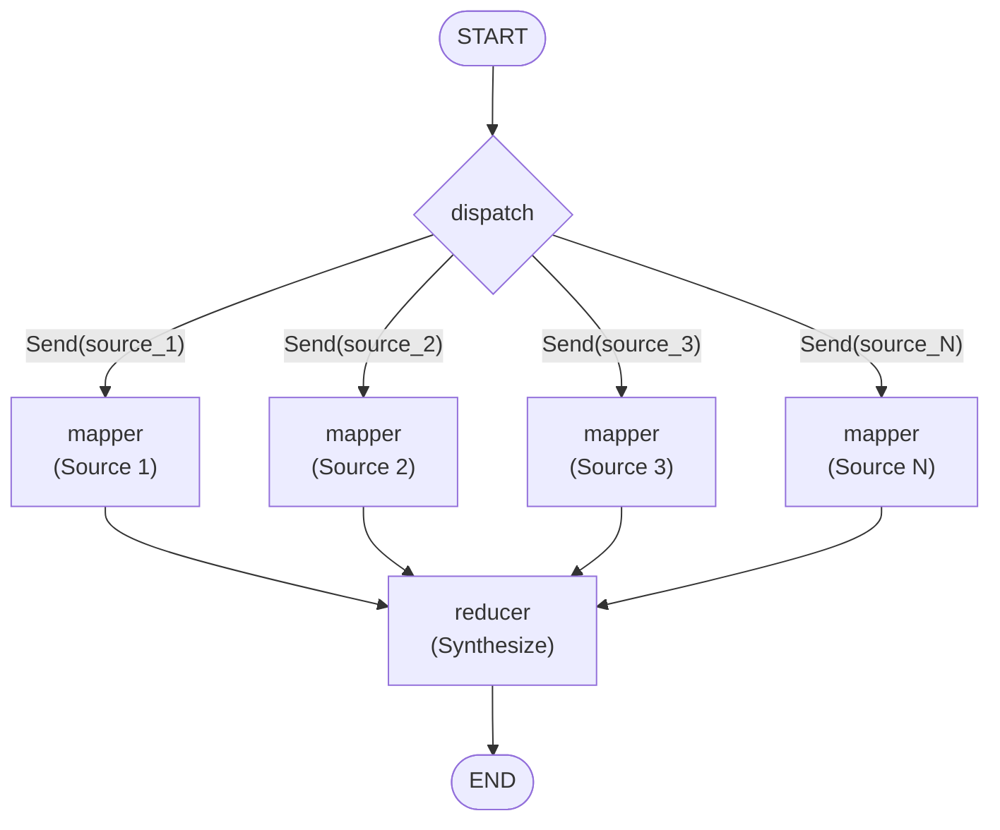

# MapReduce Pattern

> Parallel fan-out processing with result aggregation -- powered by LangGraph's Send API.

## What Is the MapReduce Pattern?

The MapReduce pattern splits a large task into independent sub-tasks (**map**), processes them in parallel, and then combines the results into a single output (**reduce**). In a multi-agent context this means:

1. **Dispatch** -- Dynamically decide how many workers to spawn based on input data.
2. **Map (fan-out)** -- Each worker analyses one slice of the input independently.
3. **Reduce** -- A synthesiser agent merges all worker outputs into a coherent result.

LangGraph's `Send` API makes the fan-out truly dynamic: the number of mapper nodes is determined at runtime, not at graph-definition time.

## When to Use

| Good Fit | Poor Fit |
|----------|----------|
| Multi-source research / analysis | Tasks requiring iterative refinement (use Reflection) |
| Parallel document summarisation | Adversarial quality improvement (use Debate) |
| Batch data extraction from N inputs | Sequential reasoning chains |
| Any "embarrassingly parallel" workload | Tasks with strong inter-step dependencies |

## Architecture



**Key mechanism:** `add_conditional_edges(START, dispatch)` returns a list of `Send` objects. LangGraph creates one mapper invocation per `Send`, running them concurrently.

## Core Code

### State definitions

```python
class MapReduceState(TypedDict):
    topic: str
    sources: list[str]
    results: Annotated[list[dict], operator.add]  # auto-merged across mappers
    final_summary: str

class WorkerState(TypedDict):
    source: str
    topic: str
```

`Annotated[list[dict], operator.add]` tells LangGraph to **merge** the `results` lists from all mapper outputs via concatenation, which is what makes the fan-out work seamlessly.

### Fan-out with Send

```python
def _dispatch(self, state: MapReduceState) -> list[Send]:
    return [
        Send("mapper", {"source": s, "topic": state["topic"]})
        for s in state["sources"]
    ]
```

### Graph construction

```python
def build_graph(self) -> StateGraph:
    graph = StateGraph(MapReduceState)
    graph.add_node("mapper", self._mapper)
    graph.add_node("reducer", self._reducer)

    graph.add_conditional_edges(START, self._dispatch, ["mapper"])
    graph.add_edge("mapper", "reducer")
    graph.add_edge("reducer", END)

    return graph.compile()
```

## Quick Start

```bash
# 1. Clone and install
git clone https://github.com/your-org/agentflow.git
cd agentflow && pip install -e .

# 2. Set your API key
echo "OPENAI_API_KEY=sk-..." > .env

# 3. Run the example
python -m patterns.map_reduce.example
```

## Configuration

| Parameter | Default | Description |
|-----------|---------|-------------|
| `model` | `"gpt-4o-mini"` | OpenAI model name for all LLM calls |
| `llm` | `None` | Pass any `BaseChatModel` to override the default |

You can also inject a completely custom LLM (e.g. Anthropic, local Ollama) via the `llm` parameter:

```python
from langchain_anthropic import ChatAnthropic

pattern = MapReducePattern(llm=ChatAnthropic(model="claude-sonnet-4-20250514"))
```

## Example Output

```
============================================================
MAPREDUCE PATTERN -- Multi-Source News Analysis
============================================================

Topic: Current State of the AI Industry in 2024
Sources Analyzed: 4

============================================================
INDIVIDUAL ANALYSES:
============================================================

>>> TechCrunch: Report on latest AI funding rounds ...
    AI funding has surged to record levels in 2024, with ...

>>> Reuters: Analysis of global semiconductor supply ...
    The semiconductor supply chain continues to face ...

>>> MIT Technology Review: Breakthroughs in large ...
    Significant efficiency gains in LLM architectures ...

>>> Bloomberg: Wall Street's adoption of AI trading ...
    Financial institutions are rapidly integrating AI ...

============================================================
FINAL SYNTHESIS:
============================================================
The AI industry in 2024 is characterized by unprecedented ...
```

## Comparison with Other Patterns

| Dimension | MapReduce | Reflection | Debate |
|-----------|-----------|------------|--------|
| Topology | Fan-out / fan-in | Loop (generator + critic) | Loop (proponent vs. opponent) |
| Parallelism | High (N workers) | None (sequential) | None (sequential) |
| Best for | Independent sub-tasks | Iterative quality improvement | Exploring opposing viewpoints |
| LLM calls | N + 1 | 2 * iterations | 2 * rounds + judge |
| Latency scaling | O(1) wall-clock (parallel) | O(iterations) | O(rounds) |

## File Structure

```
patterns/map_reduce/
├── __init__.py
├── pattern.py          # Core MapReducePattern class
├── example.py          # Runnable example
├── diagram.mmd         # Mermaid architecture diagram
├── README.md           # This file
├── README_zh.md        # Chinese documentation
└── tests/
    ├── __init__.py
    └── test_map_reduce.py
```
