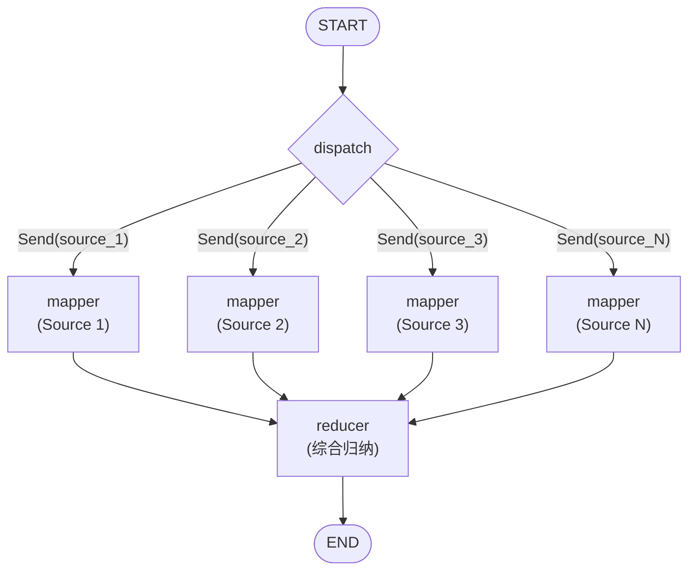

# MapReduce 模式

> 基于 LangGraph Send API 的并行扇出处理与结果聚合模式。

## 什么是 MapReduce 模式？

MapReduce 模式将一个大任务拆分为若干独立子任务（**Map**），并行处理后，再将所有结果汇总为统一输出（**Reduce**）。在多 Agent 系统中，这意味着：

1. **调度（Dispatch）** -- 根据输入数据动态决定要启动多少个工作 Agent。
2. **映射（Map / 扇出）** -- 每个工作 Agent 独立分析输入的一个切片。
3. **归约（Reduce）** -- 汇总 Agent 将所有工作 Agent 的输出合并为一份连贯的最终结果。

LangGraph 的 `Send` API 使扇出真正动态化：mapper 节点的数量在运行时由输入数据决定，而非在图定义阶段写死。

## 适用场景

| 适用 | 不适用 |
|------|--------|
| 多源研究/分析 | 需要迭代改进的任务（应使用 Reflection 模式） |
| 并行文档摘要 | 对抗式质量提升（应使用 Debate 模式） |
| 从 N 个输入中批量提取数据 | 顺序推理链 |
| 任何"天然可并行"的工作负载 | 步骤之间有强依赖关系的任务 |

## 架构图



**核心机制：** `add_conditional_edges(START, dispatch)` 返回 `Send` 对象列表。LangGraph 为每个 `Send` 创建一个 mapper 调用，并发执行。

## 核心代码

### 状态定义

```python
class MapReduceState(TypedDict):
    topic: str
    sources: list[str]
    results: Annotated[list[dict], operator.add]  # 跨 mapper 自动合并
    final_summary: str

class WorkerState(TypedDict):
    source: str
    topic: str
```

`Annotated[list[dict], operator.add]` 告诉 LangGraph 通过列表拼接来**合并**所有 mapper 输出中的 `results`，这正是扇出能无缝工作的关键。

### 使用 Send 实现扇出

```python
def _dispatch(self, state: MapReduceState) -> list[Send]:
    return [
        Send("mapper", {"source": s, "topic": state["topic"]})
        for s in state["sources"]
    ]
```

### 图的构建

```python
def build_graph(self) -> StateGraph:
    graph = StateGraph(MapReduceState)
    graph.add_node("mapper", self._mapper)
    graph.add_node("reducer", self._reducer)

    graph.add_conditional_edges(START, self._dispatch, ["mapper"])
    graph.add_edge("mapper", "reducer")
    graph.add_edge("reducer", END)

    return graph.compile()
```

## 快速开始

```bash
# 1. 克隆并安装
git clone https://github.com/your-org/agentflow.git
cd agentflow && pip install -e .

# 2. 设置 API Key
echo "OPENAI_API_KEY=sk-..." > .env

# 3. 运行示例
python -m patterns.map_reduce.example
```

## 配置项

| 参数 | 默认值 | 说明 |
|------|--------|------|
| `model` | `"gpt-4o-mini"` | 所有 LLM 调用使用的 OpenAI 模型名称 |
| `llm` | `None` | 传入任意 `BaseChatModel` 以覆盖默认模型 |

你也可以注入完全自定义的 LLM（如 Anthropic、本地 Ollama）：

```python
from langchain_anthropic import ChatAnthropic

pattern = MapReducePattern(llm=ChatAnthropic(model="claude-sonnet-4-20250514"))
```

## 示例输出

```
============================================================
MAPREDUCE PATTERN -- Multi-Source News Analysis
============================================================

Topic: Current State of the AI Industry in 2024
Sources Analyzed: 4

============================================================
INDIVIDUAL ANALYSES:
============================================================

>>> TechCrunch: Report on latest AI funding rounds ...
    2024年AI领域融资再创新高……

>>> Reuters: Analysis of global semiconductor supply ...
    全球半导体供应链持续面临挑战……

>>> MIT Technology Review: Breakthroughs in large ...
    大语言模型架构取得了显著的效率提升……

>>> Bloomberg: Wall Street's adoption of AI trading ...
    金融机构正在加速整合AI交易算法……

============================================================
FINAL SYNTHESIS:
============================================================
2024年的AI产业呈现出前所未有的……
```

## 与其他模式的对比

| 维度 | MapReduce | Reflection（反思） | Debate（辩论） |
|------|-----------|-------------------|---------------|
| 拓扑结构 | 扇出 / 扇入 | 循环（生成器 + 评审） | 循环（正方 vs. 反方） |
| 并行度 | 高（N 个工作节点） | 无（顺序执行） | 无（顺序执行） |
| 最适合 | 独立子任务 | 迭代质量改进 | 探索对立观点 |
| LLM 调用次数 | N + 1 | 2 x 迭代次数 | 2 x 轮数 + 裁判 |
| 延迟增长 | O(1) 墙钟时间（并行） | O(迭代次数) | O(轮数) |

## 文件结构

```
patterns/map_reduce/
├── __init__.py
├── pattern.py          # 核心 MapReducePattern 类
├── example.py          # 可运行示例
├── diagram.mmd         # Mermaid 架构图源文件
├── README.md           # 英文文档
├── README_zh.md        # 本文件（中文文档）
└── tests/
    ├── __init__.py
    └── test_map_reduce.py
```
