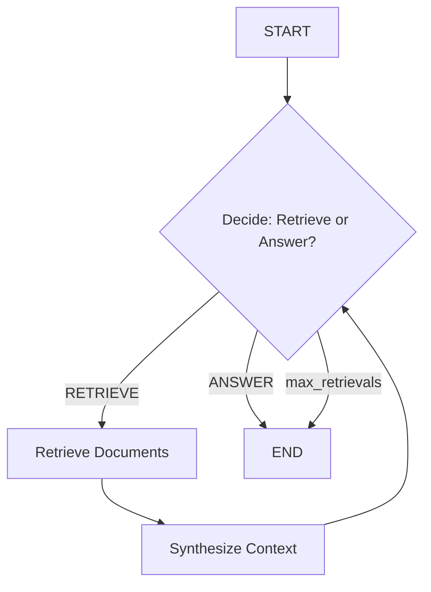

# RAG-Agent Pattern

> An agent that decides when to retrieve additional context from a knowledge base, synthesizes the retrieved information, and produces grounded responses.

## When to Use

- **Question answering over a knowledge base** where answers must be grounded in specific documents
- **Codebase-aware AI assistants** that need to read source files before answering
- **Document Q&A** with selective retrieval (not all queries need retrieval)
- **Real-time information lookup** during reasoning where stale knowledge is insufficient
- **Multi-hop reasoning** where answering requires synthesizing information across multiple sources

## When NOT to Use

- **General knowledge queries** — if the LLM already knows the answer, retrieval adds unnecessary latency
- **Fixed retrieval patterns** — if you always retrieve the same sources, use MapReduce instead
- **Simple keyword search** — a traditional search engine is faster and more appropriate
- **When you need ALL documents** — RAG-Agent selectively retrieves; if you need exhaustive coverage, use MapReduce

## Architecture



## Key Concepts

The **RAG-Agent Pattern** combines the reasoning capabilities of an LLM with selective retrieval from an external knowledge base. Unlike **MapReduce**, which retrieves all sources regardless of relevance, RAG-Agent decides whether retrieval is needed based on the query.

The key distinction from **MapReduce**:
- **MapReduce**: Fixed retrieval pipeline — all sources are analyzed regardless of relevance
- **RAG-Agent**: Conditional retrieval — the agent decides what's needed, reducing unnecessary retrieval

The agent loop:
1. **Decide**: Given the query and any previously retrieved context, should I retrieve more or answer?
2. **Retrieve**: If yes, retrieve specific documents from the knowledge base
3. **Synthesize**: Update context with newly retrieved documents
4. **Loop**: Go back to Decide until satisfied or max retrievals reached

## Quick Start

```bash
cd patterns/rag_agent
python example.py
```

## Core Code

```python
def _decide(self, state: RAGAgentState) -> dict:
    """Agent decides whether to retrieve more or answer."""
    response = self.llm.invoke(messages)
    # Parse ## Decision: RETRIEVE or ANSWER
    # Return should_retrieve, docs_to_retrieve, response, reasoning
```

## How It Works

1. **Decide**: Agent evaluates the query and determines if additional context is needed
2. **Retrieve** (if needed): Specific documents are retrieved from the knowledge base
3. **Synthesize**: Retrieved documents are integrated into the agent's context
4. **Loop**: The agent decides again with the updated context
5. **Answer**: Once satisfied (or max retrievals reached), the agent produces a final answer

## Configuration

| Parameter | Default | Description |
|-----------|---------|-------------|
| `model` | `gpt-4o-mini` | LLM model name |
| `llm` | `None` | Pre-configured LLM instance |
| `max_retrievals` | `3` | Maximum number of retrieval iterations |

## Comparison with Other Patterns

| Aspect | RAG-Agent | MapReduce | Reflection |
|--------|-----------|-----------|------------|
| Retrieval trigger | Agent decision | Always all sources | Never (internal knowledge) |
| Retrieval scope | Selective | Exhaustive | N/A |
| Agent autonomy | High (decides what to retrieve) | Low (fixed pipeline) | Medium (decides when to stop) |
| Best for | Multi-hop Q&A | Comprehensive analysis | Quality improvement |
| Latency | Query-dependent | Always high | Low |

## Example Output

```
QUERY: What is Python and when was it created?
Retrievals: 1
Documents Retrieved: 1
  - [doc1]
Response: Python is a high-level programming language known for its readability.
Created by Guido van Rossum in 1991...
```
