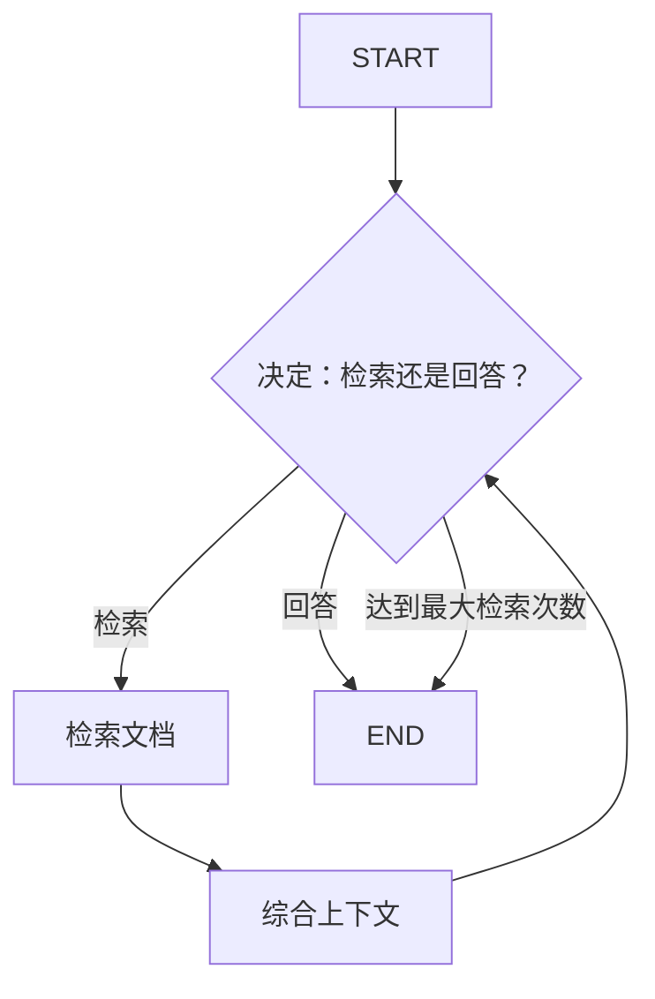

# RAG-Agent Pattern（检索增强 Agent 模式）

> 一个 Agent 自主决定何时从知识库检索额外上下文，综合检索到的信息，产出有依据的回复。

## 适用场景

- **基于知识库的问答**——答案必须基于特定文档
- **代码库感知的 AI 助手**——需要先读取源文件才能回答
- **文档问答**——选择性检索（并非所有查询都需要检索）
- **实时信息查询**——推理过程中需要最新知识
- **多跳推理**——需要综合多个来源的信息才能回答

## 不适用场景

- **通用知识查询**——如果 LLM 已知答案，检索只会增加不必要的延迟
- **固定检索模式**——如果总是检索相同来源，使用 MapReduce
- **简单关键词搜索**——传统搜索引擎更快更合适
- **需要所有文档**——RAG-Agent 选择性检索；如果需要穷举覆盖，使用 MapReduce

## 架构图



## 核心概念

**RAG-Agent Pattern** 将 LLM 的推理能力与外部知识库的选择性检索相结合。与 **MapReduce** 的区别：MapReduce 无论相关性如何都检索所有来源；RAG-Agent 根据查询决定是否需要检索。

与 **MapReduce** 的关键区别：
- **MapReduce**：固定检索管道——所有来源都被分析
- **RAG-Agent**：条件检索——Agent 决定需要什么，减少不必要的检索

Agent 循环：
1. **决定**：给定查询和已检索的上下文，决定是需要更多检索还是直接回答
2. **检索**（如需要）：从知识库检索特定文档
3. **综合**：将新检索的文档整合到 Agent 的上下文中
4. **循环**：Agent 用更新后的上下文再次决策
5. **回答**：满意后（或达到最大检索次数），Agent 产出最终答案

## 快速开始

```bash
cd patterns/rag_agent
python example.py
```

## 核心代码

```python
def _decide(self, state: RAGAgentState) -> dict:
    """Agent 决定是否检索更多或直接回答"""
    response = self.llm.invoke(messages)
    # 解析 ## Decision: RETRIEVE 或 ANSWER
    # 返回 should_retrieve, docs_to_retrieve, response, reasoning
```

## 工作流程

1. **决定**：Agent 评估查询，判断是否需要额外上下文
2. **检索**（如需要）：从知识库检索特定文档
3. **综合**：将检索到的文档整合到 Agent 的上下文中
4. **循环**：Agent 用更新后的上下文再次决策
5. **回答**：满意后（或达到最大检索次数），Agent 产出最终答案

## 配置参数

| 参数 | 默认值 | 说明 |
|------|--------|------|
| `model` | `gpt-4o-mini` | LLM 模型名称 |
| `llm` | `None` | 预配置的 LLM 实例 |
| `max_retrievals` | `3` | 最大检索迭代次数 |

## 与其他模式对比

| 维度 | RAG-Agent | MapReduce | Reflection |
|------|-----------|-----------|------------|
| 检索触发 | Agent 决策 | 总是检索所有来源 | 从不（内部知识） |
| 检索范围 | 选择性 | 穷举式 | N/A |
| Agent 自主性 | 高 | 低 | 中 |
| 最佳场景 | 多跳问答 | 全面分析 | 质量提升 |
| 延迟 | 按需 | 总是高 | 低 |

## 示例输出

```
查询: Python 是什么？何时创建的？
检索次数: 1
检索到的文档: 1
  - [doc1]
回答: Python 是一种高级编程语言，以可读性著称。
由 Guido van Rossum 于 1991 年创建...
```
