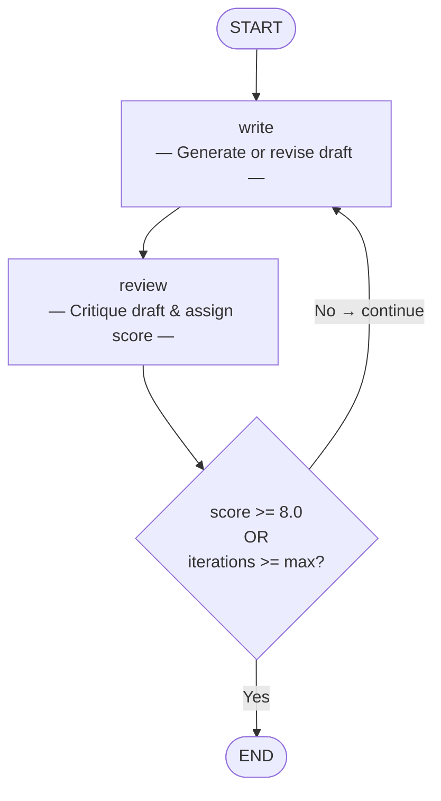

# Reflection Pattern

> **Iterative self-improvement through write → review loops.**

The Reflection pattern pairs a **writer** agent with a **reviewer** agent. The writer produces a draft, the reviewer critiques it and assigns a numeric score, and the writer revises — repeating until the score meets a quality threshold or a maximum number of iterations is reached.

This is the simplest — yet surprisingly effective — multi-agent pattern. It mirrors the human editorial process and reliably improves output quality with each cycle.

---

## When to Use

| Good fit | Poor fit |
|----------|----------|
| Content generation (articles, emails, reports) | Tasks with a single correct answer (math, lookup) |
| Code generation that benefits from self-review | Real-time / latency-sensitive applications |
| Iterative refinement of any text artefact | Problems that need external tool use or retrieval |
| Situations where quality matters more than speed | Simple one-shot tasks where first output is sufficient |

---

## Architecture



**State** flows through the graph:

| Field | Type | Description |
|-------|------|-------------|
| `topic` | `str` | The writing topic |
| `draft` | `str` | Current article draft |
| `feedback` | `str` | Reviewer's latest feedback |
| `score` | `float` | Reviewer's score (0–10) |
| `iteration` | `int` | Number of write cycles completed |
| `history` | `list[str]` | All draft versions (append-only) |

---

## Core Code

```python
from patterns.reflection.pattern import ReflectionPattern

pattern = ReflectionPattern(
    max_iterations=3,
    score_threshold=8.0,
)
result = pattern.run("The Future of AI Agents")

print(result["draft"])    # Final polished article
print(result["score"])    # Reviewer's final score
print(result["iteration"])  # How many cycles it took
```

### Configuration Options

| Parameter | Default | Description |
|-----------|---------|-------------|
| `model` | `"gpt-4o-mini"` | OpenAI model name (ignored when `llm` is provided) |
| `llm` | `None` | Pre-configured LangChain `BaseChatModel` instance |
| `max_iterations` | `3` | Maximum write → review cycles |
| `score_threshold` | `8.0` | Minimum score (out of 10) to accept and stop |

---

## Quick Start

```bash
# 1. Clone and install
git clone https://github.com/your-org/agentflow.git
cd agentflow && uv sync

# 2. Set your API key
echo "OPENAI_API_KEY=sk-..." > .env

# 3. Run the example
uv run python -m patterns.reflection.example
```

---

## Example Output

```
============================================================
REFLECTION PATTERN -- AI Article Writer
============================================================

Topic: The Future of AI Agents in Software Development
Iterations: 2
Final Score: 8.5/10

============================================================
FINAL DRAFT:
============================================================
# The Future of AI Agents in Software Development

Software development is on the cusp of its most significant
transformation since the rise of open source.  AI agents — autonomous
programs that can plan, write, test, and deploy code with minimal
human oversight — are moving from research prototypes to everyday
tools...

[article continues ~800 words]

============================================================
Revision History: 2 drafts written
```

The first draft typically scores 6–7/10. After one or two revision cycles the reviewer's feedback is addressed and the score rises above the threshold.

---

## How It Works — Step by Step

1. **Write (iteration 1):** The writer agent receives the topic and produces a first draft.
2. **Review:** The reviewer agent reads the draft, lists strengths and weaknesses, and outputs a score line (`Score: 6.5/10`).
3. **Route:** The conditional edge checks `score >= threshold` and `iteration >= max_iterations`. If neither is met, the graph loops back to the writer.
4. **Write (iteration 2+):** The writer receives both its previous draft and the reviewer's feedback, then produces a targeted revision.
5. **Repeat** until the quality bar is met or iterations run out.

---

## Comparison with Other Patterns

| Dimension | Reflection | Debate | MapReduce |
|-----------|-----------|--------|-----------|
| **Agents** | 2 (writer + reviewer) | 2+ adversarial debaters | 1 mapper × N + 1 reducer |
| **Interaction** | Sequential loop | Adversarial rounds | Parallel fan-out → merge |
| **Best for** | Iterative refinement | Exploring opposing viewpoints | Large-scale data processing |
| **Latency** | Medium (sequential rounds) | Medium–High | Low (parallel execution) |
| **Complexity** | Low | Medium | Medium |

The Reflection pattern is the recommended starting point when you need quality improvement — it is the easiest to implement, debug, and reason about. Reach for Debate when you need to explore genuinely opposing perspectives, and MapReduce when you need to process many items in parallel.

---

## Running Tests

```bash
uv run pytest patterns/reflection/tests/ -v
```

Tests use mocked LLMs and require no API key.

---

## File Structure

```
patterns/reflection/
├── __init__.py
├── pattern.py        # Core ReflectionPattern class
├── example.py        # One-click runnable demo
├── diagram.mmd       # Mermaid architecture diagram source
├── README.md         # This file (English)
├── README_zh.md      # Chinese documentation
└── tests/
    ├── __init__.py
    └── test_reflection.py
```
