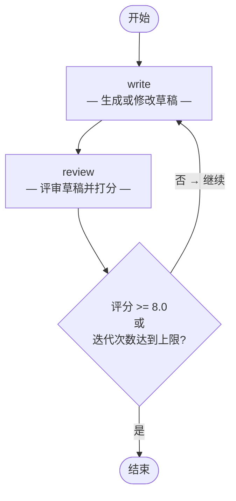

# 反思模式 (Reflection Pattern)

> **通过"写作 → 评审"循环实现迭代式自我改进。**

反思模式将一个 **写作 Agent** 与一个 **评审 Agent** 配对工作。写作 Agent 产出初稿，评审 Agent 给出具体反馈并打分，写作 Agent 据此修改——如此循环，直到评分达标或达到最大迭代次数。

这是最简单、却出奇有效的多 Agent 模式。它模拟了人类的编辑流程，每次迭代都能可靠地提升产出质量。

---

## 适用场景

| 适合使用 | 不适合使用 |
|----------|-----------|
| 内容生成（文章、邮件、报告） | 有唯一正确答案的任务（数学计算、信息检索） |
| 需要自审的代码生成 | 对延迟敏感的实时应用 |
| 任何文本产物的迭代优化 | 需要外部工具调用或知识检索的场景 |
| 质量优先于速度的场景 | 一次生成即可满足需求的简单任务 |

---

## 架构



**状态 (State)** 在图中流转：

| 字段 | 类型 | 说明 |
|------|------|------|
| `topic` | `str` | 写作主题 |
| `draft` | `str` | 当前草稿 |
| `feedback` | `str` | 评审的最新反馈 |
| `score` | `float` | 评审评分（0–10） |
| `iteration` | `int` | 已完成的写作轮次 |
| `history` | `list[str]` | 所有草稿版本（只追加） |

---

## 核心代码

```python
from patterns.reflection.pattern import ReflectionPattern

pattern = ReflectionPattern(
    max_iterations=3,
    score_threshold=8.0,
)
result = pattern.run("AI Agent 的未来")

print(result["draft"])      # 最终打磨后的文章
print(result["score"])      # 评审最终评分
print(result["iteration"])  # 经历了几轮迭代
```

### 配置参数

| 参数 | 默认值 | 说明 |
|------|--------|------|
| `model` | `"gpt-4o-mini"` | OpenAI 模型名称（提供 `llm` 时忽略） |
| `llm` | `None` | 预配置的 LangChain `BaseChatModel` 实例 |
| `max_iterations` | `3` | 最大写作-评审循环次数 |
| `score_threshold` | `8.0` | 达到此评分（满分 10）即停止迭代 |

---

## 快速开始

```bash
# 1. 克隆并安装依赖
git clone https://github.com/your-org/agentflow.git
cd agentflow && uv sync

# 2. 配置 API Key
echo "OPENAI_API_KEY=sk-..." > .env

# 3. 运行示例
uv run python -m patterns.reflection.example
```

---

## 示例输出

```
============================================================
REFLECTION PATTERN -- AI Article Writer
============================================================

Topic: The Future of AI Agents in Software Development
Iterations: 2
Final Score: 8.5/10

============================================================
FINAL DRAFT:
============================================================
# The Future of AI Agents in Software Development

Software development is on the cusp of its most significant
transformation since the rise of open source.  AI agents — autonomous
programs that can plan, write, test, and deploy code with minimal
human oversight — are moving from research prototypes to everyday
tools...

[文章正文约 800 词]

============================================================
Revision History: 2 drafts written
```

通常初稿评分在 6–7 分之间，经过一到两轮修改后，评审反馈被充分采纳，评分会超过阈值。

---

## 工作原理详解

1. **写作（第 1 轮）：** 写作 Agent 收到主题，产出第一版草稿。
2. **评审：** 评审 Agent 阅读草稿，列出优缺点，并给出评分（如 `Score: 6.5/10`）。
3. **路由决策：** 条件边检查 `评分 >= 阈值` 和 `迭代次数 >= 最大次数`。如果都不满足，回到写作节点。
4. **写作（第 2 轮+）：** 写作 Agent 同时收到上一版草稿和评审反馈，针对性地修改。
5. **循环** 直到质量达标或迭代次数用尽。

---

## 与其他模式的对比

| 维度 | 反思模式 | 辩论模式 | MapReduce 模式 |
|------|---------|---------|---------------|
| **Agent 数量** | 2（写作 + 评审） | 2+ 个对抗性辩手 | 1 个 mapper × N + 1 个 reducer |
| **交互方式** | 顺序循环 | 对抗式多轮辩论 | 并行扇出 → 合并 |
| **最佳场景** | 迭代优化 | 探索对立观点 | 大规模数据处理 |
| **延迟** | 中等（顺序执行多轮） | 中高 | 低（并行执行） |
| **实现复杂度** | 低 | 中等 | 中等 |

反思模式是需要质量提升时的推荐起点——实现最简单、调试最容易、推理最直观。当需要探索真正对立的观点时选择辩论模式，需要并行处理大量条目时选择 MapReduce 模式。

---

## 运行测试

```bash
uv run pytest patterns/reflection/tests/ -v
```

测试使用 Mock LLM，无需 API Key。

---

## 文件结构

```
patterns/reflection/
├── __init__.py
├── pattern.py          # 核心 ReflectionPattern 类
├── example.py          # 一键可运行的演示
├── diagram.mmd         # Mermaid 架构图源文件
├── README.md           # 英文文档
├── README_zh.md        # 本文件（中文文档）
└── tests/
    ├── __init__.py
    └── test_reflection.py
```
