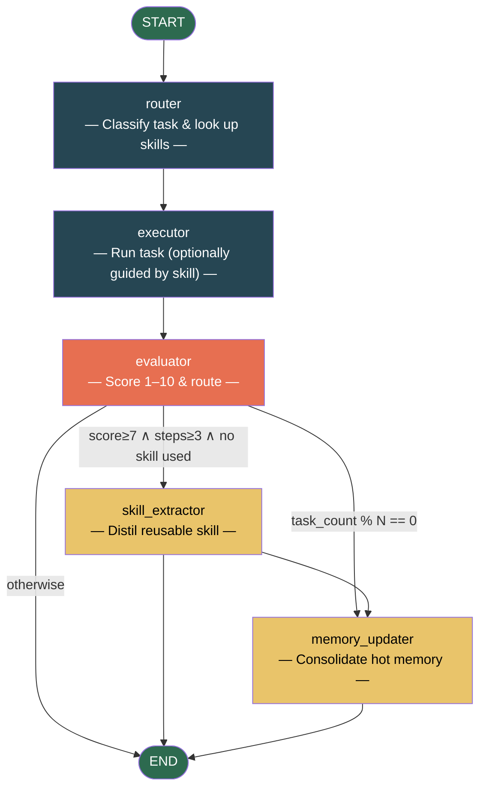

# Self-Improving Pattern

> **Build a persistent skill library and improve across tasks.**

The Self-Improving pattern gives an agent a layered memory system so it gets better the more you use it. It automatically distils successful task completions into reusable *skills*, retrieves them on similar future tasks, and periodically consolidates its hot memory to keep it bounded in size.

This is the only AgentFlow pattern that learns *across runs* -- state persists between invocations.

---

## When to Use

| Good fit | Poor fit |
|----------|----------|
| Long-running AI assistants / coding agents | One-off, single-use tasks |
| Repeated task patterns (code reviews, data analysis, debugging) | Purely random or exploratory tasks |
| Cross-session learning -- agent improves as you use it | Privacy-sensitive environments where persisting data is unacceptable |
| Scenarios where quality compounds over time | Tasks with no reusable procedure (pure Q&A) |

---

## Architecture



**State** flows through the graph:

| Field | Type | Description |
|-------|------|-------------|
| `task` | `str` | Current task description |
| `task_type` | `str` | Classified task category (e.g. `code_review`) |
| `matched_skill` | `dict \| None` | Retrieved skill document (full content), if any |
| `execution_steps` | `list[str]` | Steps the executor recorded |
| `result` | `str` | Final execution result |
| `evaluation_score` | `float` | Quality score 1–10 from the evaluator |
| `should_create_skill` | `bool` | Whether the run warrants a new skill |
| `should_update_memory` | `bool` | Whether the periodic nudge should fire |
| `task_count` | `int` | Running count of completed tasks |

---

## Core Code

```python
from patterns.self_improving import SelfImprovingPattern, MemoryStore

# storage_dir persists across runs -- the agent's skill library lives here.
pattern = SelfImprovingPattern(
    storage_dir="./.my_agent_memory",
    nudge_interval=5,       # consolidate memory every 5 tasks
    skill_threshold=7.0,     # minimum score to extract a skill
    min_steps_for_skill=3,   # skip single-step tasks
)
result = pattern.run("Review this REST endpoint for security issues")
print(f"Score: {result['evaluation_score']}/10")
print(f"Matched skill: {result['matched_skill']}")
```

### Configuration

| Parameter | Default | Description |
|-----------|---------|-------------|
| `model` | `"gpt-4o-mini"` | Model name (via `agentflow.utils.get_default_llm`) |
| `llm` | `None` | Pre-configured LangChain chat model |
| `storage_dir` | `"./.agent_memory"` | Directory for `MEMORY.json` + `skills/*.json` |
| `nudge_interval` | `5` | Consolidate hot memory every N tasks |
| `skill_threshold` | `7.0` | Min score to create a skill (out of 10) |
| `min_steps_for_skill` | `3` | Min executor steps to warrant skill creation |

---

## Quick Start

```bash
# 1. Clone and install
git clone https://github.com/your-org/agentflow.git
cd agentflow && uv sync

# 2. Set API key
cp .env.example .env
# Add your OPENAI_API_KEY or DEEPSEEK_API_KEY

# 3. Run the demo
uv run python -m patterns.self_improving.example
```

The demo runs 5 tasks. By the third code-review task the agent should have built and retrieved a `code_review` skill -- watch for the `Matched skill` line to flip from `None` to the skill name.

---

## How It Works

### 1. Layered Memory

**Hot memory** (`MEMORY.json`) is a small, always-loaded snapshot injected into every system prompt. It holds environment facts, conventions, and lessons learned -- bounded to ~2000 characters so prompt overhead stays flat.

**Skill store** (`skills/*.json`) is cold storage. Only the skill *index* (name + one-line description) is loaded by the router. When the router finds a match, the full skill document is fetched on demand.

### 2. Progressive Disclosure

The router's prompt costs only a few extra tokens (skill names only). Full skill content is only loaded when the task matches. This mirrors the Hermes Agent's insight that **"skill names are cheap, skill bodies are expensive"** -- load the expensive parts only when you know they're relevant.

### 3. Periodic Nudge

Every `nudge_interval` tasks, the `memory_updater` node fires. It asks the LLM to consolidate the hot memory: merge duplicates, drop stale entries, and add new durable lessons. This prevents the memory from growing unbounded while keeping actionable knowledge surfaced.

### 4. Skill Extraction

When a run scores above `skill_threshold` with at least `min_steps_for_skill` steps (and didn't reuse an existing skill), the `skill_extractor` node fires. It generates a structured skill document with `procedure`, `pitfalls`, and `verification` fields -- capturing the *method*, not just the result.

---

## Comparison with Other Patterns

| Dimension | Self-Improving | Reflection | Chain-of-Experts |
|-----------|---------------|------------|-----------------|
| **Learning scope** | Cross-task, persistent | Within-task, ephemeral | Across fixed experts, no persistence |
| **Memory** | Hot + cold layered | None (state only) | None |
| **Skill reuse** | Dynamic, auto-extracted | N/A | Static, pre-defined routing |
| **Best for** | Long-running assistants, code agents | Iterative text refinement | Sequential specialist routing |
| **Latency** | Medium (extra LLM calls for eval/extraction) | Medium (write-review cycles) | Low (fixed sequence) |

---

## Run Tests

```bash
uv run pytest patterns/self_improving/tests/ -v
```

Tests use mocked LLMs and isolated `tmp_path` storage -- no API key needed.

---

## File Structure

```
patterns/self_improving/
├── __init__.py
├── pattern.py          # SelfImprovingPattern class + MemoryStore
├── example.py          # Runnable demo (5-task skill library demo)
├── diagram.mmd         # Mermaid source
├── README.md           # This file
├── README_zh.md        # Chinese version
├── py.typed            # PEP 561 marker
└── tests/
    ├── __init__.py
    └── test_self_improving.py   # 20+ mock-LLM tests
```
