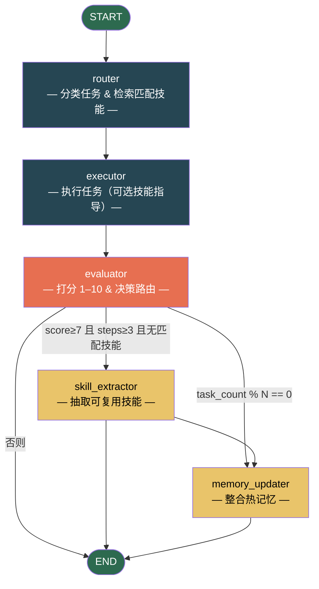

# 自我改进模式 (Self-Improving Pattern)

> **通过持久化的技能库实现跨任务自我改进。**

自我改进模式为 Agent 赋予了一套分层记忆系统，使其越用越强。它会从成功的任务执行中自动提炼出可复用的**技能（Skill）**，在后续相似任务中检索并使用它们，并周期性整合热记忆以防止其无限膨胀。

这是 AgentFlow 中唯一一个支持**跨轮次学习**的模式——状态在多次调用之间持久化。

---

## 适用场景

| 适合使用 | 不适合使用 |
|----------|-----------|
| 长期运行的 AI 助手 / 编码 Agent | 一次性、单一用途的任务 |
| 重复性任务模式（代码审查、数据分析、调试） | 纯随机或探索性任务 |
| 跨会话学习 —— Agent 随使用次数增长能力 | 对持久化数据敏感的隐私环境 |
| 质量随时间累积的场景 | 无可复用流程的任务（纯问答） |

---

## 架构



**State** 在图中流转：

| 字段 | 类型 | 说明 |
|------|------|------|
| `task` | `str` | 当前任务描述 |
| `task_type` | `str` | 任务分类（如 `code_review`） |
| `matched_skill` | `dict \| None` | 匹配到的技能文档（完整内容） |
| `execution_steps` | `list[str]` | 执行器记录的步骤 |
| `result` | `str` | 最终执行结果 |
| `evaluation_score` | `float` | 评估器打分（1–10） |
| `should_create_skill` | `bool` | 本轮是否值得抽取新技能 |
| `should_update_memory` | `bool` | 是否触发周期性热记忆整合 |
| `task_count` | `int` | 已完成任务计数器 |

---

## 核心代码

```python
from patterns.self_improving import SelfImprovingPattern, MemoryStore

# storage_dir 在多次调用间持久化 —— Agent 的技能库就在这里
pattern = SelfImprovingPattern(
    storage_dir="./.my_agent_memory",
    nudge_interval=5,       # 每 5 个任务整合一次热记忆
    skill_threshold=7.0,    # 评分达到此阈值才抽取技能
    min_steps_for_skill=3,  # 单步任务通常没有可复用流程
)

result = pattern.run("审查这个 REST 端点的安全问题")
print(f"评分: {result['evaluation_score']}/10")
print(f"匹配技能: {result['matched_skill']}")
```

### 配置参数

| 参数 | 默认值 | 说明 |
|------|--------|------|
| `model` | `"gpt-4o-mini"` | 模型名（通过 `agentflow.utils.get_default_llm` 选择） |
| `llm` | `None` | 预配置的 LangChain chat model 实例 |
| `storage_dir` | `"./.agent_memory"` | `MEMORY.json` 和 `skills/*.json` 的存储目录 |
| `nudge_interval` | `5` | 每 N 个任务触发一次热记忆整合 |
| `skill_threshold` | `7.0` | 抽取技能的最低评分（满分 10） |
| `min_steps_for_skill` | `3` | 执行步骤达到此数量才考虑抽取技能 |

---

## 快速开始

```bash
# 1. 克隆并安装
git clone https://github.com/your-org/agentflow.git
cd agentflow && uv sync

# 2. 配置 API Key
cp .env.example .env
# 添加 OPENAI_API_KEY 或 DEEPSEEK_API_KEY

# 3. 运行示例
uv run python -m patterns.self_improving.example
```

示例运行 5 个任务。任务 2–4 都是代码审查，任务 3–4 时 Agent 已经建立了 `code_review` 技能——观察输出中 `Matched skill` 从 `None` 变为技能名。

---

## 工作原理详解

### 1. 分层记忆

**热记忆**（`MEMORY.json`）是一个小型的、常驻加载的快照，注入到每次系统提示中。它包含环境事实、约定俗成的规则和经验教训——大小上限约 2000 字符，确保提示开销不会随使用增长而膨胀。

**技能库**（`skills/*.json`）是冷存储。只有技能索引（名称 + 一句话描述）被路由节点加载。当路由匹配到技能后，才按需加载完整的技能文档。

### 2. 渐进式披露

路由节点的提示只多消耗少量 token（仅技能名称）。只有当任务真正匹配时，才加载完整的技能内容。这借鉴了 Hermes Agent 的洞见：**"技能名称是廉价的，技能主体是昂贵的"**——只在确定相关时才加载昂贵的部分。

### 3. 周期性 Nudge

每 `nudge_interval` 个任务，`memory_updater` 节点被触发。它让 LLM 整合热记忆：合并重复条目、删除过时条目、补充新的持久性经验。这防止记忆无限膨胀，同时保持有价值知识的可及性。

### 4. 技能抽取

当一轮运行评分高于 `skill_threshold` 且执行步骤不少于 `min_steps_for_skill`（且没有复用现有技能），`skill_extractor` 节点触发。它生成一份结构化的技能文档，包含 `procedure`（步骤）、`pitfalls`（陷阱）和 `verification`（验证方法）字段——捕获的是**方法**，而不仅仅是结果。

---

## 与其他模式的对比

| 维度 | 自我改进模式 | 反思模式 | 专家链模式 |
|------|------------|----------|-----------|
| **学习范围** | 跨任务，持久化 | 单任务内，临时 | 跨固定专家，无持久化 |
| **记忆** | 热 + 冷分层 | 无（仅 State） | 无 |
| **技能复用** | 动态，自动抽取 | 不适用 | 静态，预定义路由 |
| **最佳场景** | 长期运行助手、代码 Agent | 迭代文本精炼 | 顺序专家路由 |
| **延迟** | 中等（额外 LLM 调用） | 中等（写作-评审循环） | 低（固定顺序） |

---

## 运行测试

```bash
uv run pytest patterns/self_improving/tests/ -v
```

测试使用 Mock LLM 和隔离的 `tmp_path` 存储，无需 API Key。

---

## 文件结构

```
patterns/self_improving/
├── __init__.py
├── pattern.py          # SelfImprovingPattern 类 + MemoryStore
├── example.py          # 可运行演示（5 任务技能库演示）
├── diagram.mmd         # Mermaid 图源文件
├── README.md           # 英文文档
├── README_zh.md        # 本文件（中文文档）
├── py.typed            # PEP 561 类型标记
└── tests/
    ├── __init__.py
    └── test_self_improving.py   # 20+ Mock LLM 测试
```
