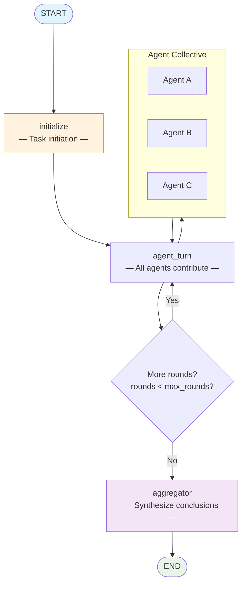

# Swarm Pattern

> **Decentralized multi-agent collective intelligence through message passing.**

The Swarm pattern uses a population of specialized agents that collaborate through message passing without a central coordinator. Agents share information, build on each other's work, and collectively reach conclusions through an aggregator.

This pattern is ideal for exploring complex problems from multiple angles simultaneously, where no single agent has all the expertise needed.

---

## When to Use

| Good fit | Poor fit |
|----------|----------|
| Complex problems requiring diverse expertise | Tasks with a single correct answer |
| Brainstorming and ideation sessions | Time-critical real-time responses |
| Problems where multiple perspectives add value | Simple, well-defined tasks |
| Research and analysis requiring broad coverage | Situations requiring strict control flow |

---

## Architecture



**State** flows through the graph:

| Field | Type | Description |
|-------|------|-------------|
| `task` | `str` | The input task |
| `agents` | `list[dict]` | List of agent definitions [{name, specialty}] |
| `messages` | `list[dict]` | All messages exchanged [{from_agent, content}] |
| `rounds` | `int` | Current round number |
| `max_rounds` | `int` | Maximum collaboration rounds |
| `termination_signal` | `str` | "" = continue, "converged"/"max_rounds" = end |
| `final_conclusion` | `str` | Aggregated conclusion |

---

## Core Code

```python
from patterns.swarm.pattern import SwarmPattern

pattern = SwarmPattern(max_rounds=3)

agents = [
    {"name": "Strategist", "specialty": "strategic planning"},
    {"name": "Technologist", "specialty": "technology trends"},
    {"name": "Economist", "specialty": "market economics"},
]

result = pattern.run(
    task="Analyze the future of remote work in tech industry",
    agents=agents,
)

print(result["final_conclusion"])  # Collective intelligence synthesis
```

### Configuration Options

| Parameter | Default | Description |
|-----------|---------|-------------|
| `model` | `"gpt-4o-mini"` | OpenAI model name (ignored when `llm` is provided) |
| `llm` | `None` | Pre-configured LangChain `BaseChatModel` instance |
| `max_rounds` | `3` | Maximum collaboration rounds |

---

## Quick Start

```bash
# 1. Clone and install
git clone https://github.com/your-org/agentflow.git
cd agentflow && uv sync

# 2. Set your API key
echo "OPENAI_API_KEY=sk-..." > .env

# 3. Run the example
uv run python -m patterns.swarm.example
```

---

## Example Output

```
============================================================
SWARM PATTERN -- Collective Intelligence
============================================================

Task: Analyze the future of remote work in tech industry
Agents: Strategist, Technologist, Economist
Rounds: 3

============================================================
FINAL CONCLUSION:
============================================================
# Collective Analysis: The Future of Remote Work

## Strategic Perspective (Strategist)
Remote work is fundamentally reshaping organizational design.
Companies must rethink talent acquisition, performance
management, and corporate culture...

## Technology Perspective (Technologist)
Emerging tools for async collaboration, VR meetings,
and distributed version control are making remote work
increasingly viable...

## Economic Perspective (Economist)
The shift to remote work is creating new economic
disparities and opportunities...

## Synthesized Conclusion
[The aggregator's integrated analysis...]
```

---

## How It Works — Step by Step

1. **Initialization:** The swarm is initialized with a task and agent definitions. An opening statement is generated.
2. **Agent Contribution:** Each agent reviews all previous messages and adds their expert perspective.
3. **Collaborative Rounds:** Multiple rounds of agent contributions, with each agent building on previous contributions.
4. **Termination:** After max_rounds, the swarm terminates and passes to the aggregator.
5. **Aggregation:** A final aggregator synthesizes all contributions into a coherent conclusion.

---

## Comparison with Other Patterns

| Dimension | Swarm | Chain-of-Experts | Debate |
|-----------|-------|------------------|--------|
| **Coordination** | Decentralized | Sequential chain | Moderated |
| **Agent relations** | Peer-to-peer | Sequential | Adversarial |
| **Best for** | Diverse perspectives | Building expertise | Opposing views |
| **Output** | Collective synthesis | Expert analysis | Win/lose |
| **Complexity** | Medium-High | Medium | Medium |

Swarm is best when you need diverse agents to collaborate as peers without central coordination. Use Chain-of-Experts when you need sequential expertise building. Use Debate when you need to explore opposing viewpoints.

---

## Running Tests

```bash
uv run pytest patterns/swarm/tests/ -v
```

Tests use mocked LLMs and require no API key.

---

## File Structure

```
patterns/swarm/
├── __init__.py
├── pattern.py        # Core SwarmPattern class
├── example.py        # One-click runnable demo
├── diagram.mmd       # Mermaid architecture diagram source
├── README.md         # This file (English)
├── README_zh.md      # Chinese documentation
└── tests/
    ├── __init__.py
    └── test_swarm.py
```
