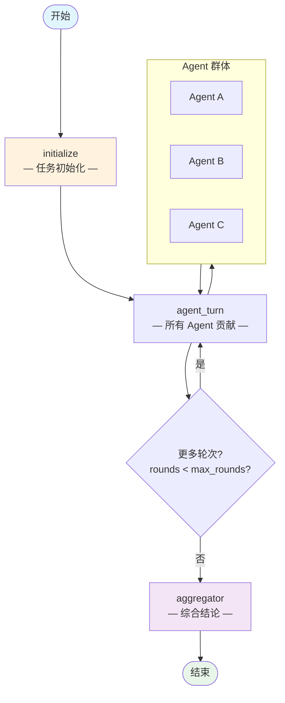

# 群体智能模式 (Swarm Pattern)

> **去中心化的多 Agent 协作，通过消息传递实现集体智能。**

群体智能模式使用一群专业 Agent，通过消息传递进行协作，无需中央协调器。Agent 之间共享信息、在彼此工作的基础上构建，最后通过综合器得出集体结论。

这种模式非常适合需要同时从多个角度探索复杂问题的情况，没有任何一个 Agent 拥有所需的全部专业知识。

---

## 适用场景

| 适合使用 | 不适合使用 |
|----------|-----------|
| 需要多样化专业知识的复杂问题 | 有唯一正确答案的任务 |
| 头脑风暴和创意构思会议 | 时间关键的实时响应 |
| 多个视角能增加价值的任何问题 | 简单的、定义明确的任务 |
| 需要广泛覆盖的研究和分析 | 需要严格控制流程的情况 |

---

## 架构



**状态 (State)** 在图中流转：

| 字段 | 类型 | 说明 |
|------|------|------|
| `task` | `str` | 输入任务 |
| `agents` | `list[dict]` | Agent 定义列表 [{name, specialty}] |
| `messages` | `list[dict]` | 所有交换的消息 [{from_agent, content}] |
| `rounds` | `int` | 当前轮次编号 |
| `max_rounds` | `int` | 最大协作轮次 |
| `termination_signal` | `str` | "" = 继续，"converged"/"max_rounds" = 结束 |
| `final_conclusion` | `str` | 综合后的结论 |

---

## 核心代码

```python
from patterns.swarm.pattern import SwarmPattern

pattern = SwarmPattern(max_rounds=3)

agents = [
    {"name": "策略师", "specialty": "战略规划"},
    {"name": "技术专家", "specialty": "技术趋势"},
    {"name": "经济学家", "specialty": "市场经济"},
]

result = pattern.run(
    task="分析科技行业远程工作的未来",
    agents=agents,
)

print(result["final_conclusion"])  # 集体智能综合
```

### 配置参数

| 参数 | 默认值 | 说明 |
|------|--------|------|
| `model` | `"gpt-4o-mini"` | OpenAI 模型名称（提供 `llm` 时忽略） |
| `llm` | `None` | 预配置的 LangChain `BaseChatModel` 实例 |
| `max_rounds` | `3` | 最大协作轮次 |

---

## 快速开始

```bash
# 1. 克隆并安装依赖
git clone https://github.com/your-org/agentflow.git
cd agentflow && uv sync

# 2. 配置 API Key
echo "OPENAI_API_KEY=sk-..." > .env

# 3. 运行示例
uv run python -m patterns.swarm.example
```

---

## 示例输出

```
============================================================
SWARM PATTERN -- 集体智能
============================================================

任务：分析科技行业远程工作的未来
Agent：策略师、技术专家、经济学家
轮次：3

============================================================
最终结论：
============================================================
# 集体分析：远程工作的未来

## 战略视角（策略师）
远程工作正在从根本上重塑组织设计。
企业必须重新思考人才招聘、绩效管理
和公司文化...

## 技术视角（技术专家）
异步协作工具、VR 会议和分布式版本控制
等新兴技术正在使远程工作越来越可行...

## 经济视角（经济学家）
向远程工作的转变正在创造新的经济
差距和机会...

## 综合结论
[综合器的整合分析...]
```

---

## 工作原理详解

1. **初始化：** 群体通过任务和 Agent 定义进行初始化。生成开场陈述。
2. **Agent 贡献：** 每个 Agent 审查所有先前的消息，并添加其专业视角。
3. **协作轮次：** 多轮 Agent 贡献，每个 Agent 在先前贡献的基础上构建。
4. **终止：** 经过 max_rounds 轮后，群体终止并转移到综合器。
5. **综合：** 最终综合器将所有贡献整合成连贯的结论。

---

## 与其他模式的对比

| 维度 | 群体智能 | 专家链 | 辩论模式 |
|------|---------|--------|---------|
| **协调方式** | 去中心化 | 顺序链式 | 主持人协调 |
| **Agent 关系** | 点对点 | 顺序传递 | 对抗性 |
| **最佳场景** | 多样化视角 | 构建专业知识 | 对立观点 |
| **输出** | 集体综合 | 专家分析 | 输赢判定 |
| **实现复杂度** | 中高 | 中等 | 中等 |

群体智能模式最适合需要多样化 Agent 作为对等体协作、无需中央协调的情况。需要顺序构建专业知识时使用专家链模式。需要探索对立观点时使用辩论模式。

---

## 运行测试

```bash
uv run pytest patterns/swarm/tests/ -v
```

测试使用 Mock LLM，无需 API Key。

---

## 文件结构

```
patterns/swarm/
├── __init__.py
├── pattern.py          # 核心 SwarmPattern 类
├── example.py          # 一键可运行的演示
├── diagram.mmd          # Mermaid 架构图源文件
├── README.md           # 英文文档
├── README_zh.md        # 本文件（中文文档）
└── tests/
    ├── __init__.py
    └── test_swarm.py
```
