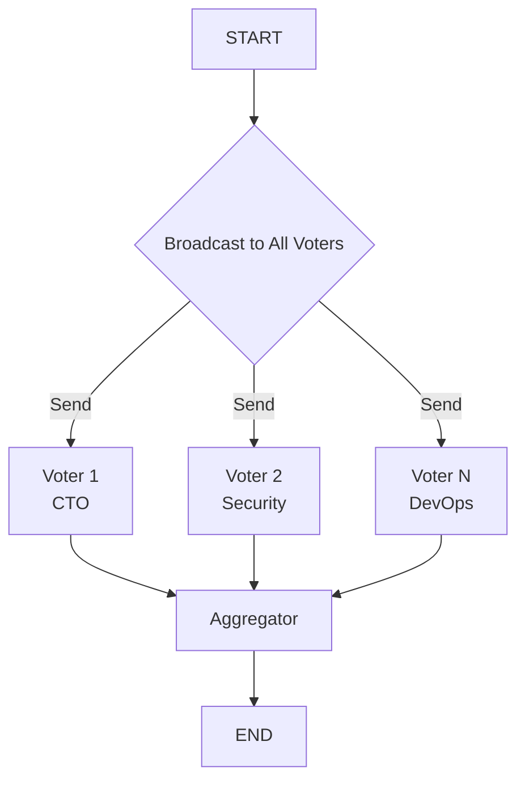

# Voting Pattern

> Multiple agents independently process the same input and cast votes, which are aggregated via majority, weighted, or unanimous voting.

## When to Use

- **Architectural or technical decisions** requiring diverse expert perspectives (security, performance, maintainability)
- **Multi-criteria evaluation** where stakeholders have different expertise levels and weights
- **Consensus building** when you need buy-in from multiple independent parties
- **Risk assessment** with independent reviewers checking different concerns
- **Best practice validation** when multiple agents check compliance against different standards

## When NOT to Use

- **Time-critical decisions** — parallel voting still requires all voters to complete before aggregation
- **Simple binary choices** — the overhead of multiple agents is not justified for trivial decisions
- **When debate is needed** — if voters need to argue and influence each other, use the Debate pattern
- **When a single expert opinion is sufficient** — don't add overhead when one knowledgeable person can decide

## Architecture



## Key Concepts

The **Voting Pattern** is designed for decision-making scenarios where multiple independent perspectives need to be collected and synthesized. Unlike **Debate**, where agents argue back and forth evolving positions, Voting agents reach independent conclusions first — there is no cross-agent influence.

Key features:
- **Broadcast fan-out**: All voters receive the identical input simultaneously via LangGraph's `Send` API
- **Independent decisions**: Each voter produces their analysis without knowing others' choices
- **Multiple aggregation strategies**:
  - `majority`: Simple vote count
  - `weighted`: Weight by voter's expertise/relevance
  - `unanimous`: All must agree or a revised recommendation is produced

## Quick Start

```bash
cd patterns/voting
python example.py
```

## Core Code

```python
def _broadcast(self, state: VotingState) -> list[Send]:
    """Fan-out: emit one Send per voter so each runs in parallel."""
    return [
        Send("voter", {
            "voter_name": voter["name"],
            "voter_expertise": voter["expertise"],
            "question": state["question"],
        })
        for voter in state["voters"]
    ]
```

## How It Works

1. **Broadcast**: The graph fans out the same question to all voters simultaneously
2. **Parallel Voting**: Each voter independently analyzes the question and produces their decision
3. **Aggregation**: The aggregator collects all votes and produces a final decision based on the chosen strategy

## Configuration

| Parameter | Default | Description |
|-----------|---------|-------------|
| `model` | `gpt-4o-mini` | LLM model name |
| `llm` | `None` | Pre-configured LLM instance |
| `voting_strategy` | `majority` | Strategy: `majority`, `weighted`, or `unanimous` |

## Comparison with Other Patterns

| Aspect | Voting | Debate | Reflection | Hierarchical |
|--------|--------|--------|------------|--------------|
| Agent relationship | Independent | Adversarial | Self-review | Manager-Worker |
| Rounds | 1 (parallel) | Multiple | Multiple | 1 (parallel workers) |
| Cross-agent influence | None | Direct | Self | None |
| Aggregation | Vote counting | Moderator | Self | Manager synthesis |
| Best for | Decision-making | Conflict resolution | Quality improvement | Multi-dimension research |
