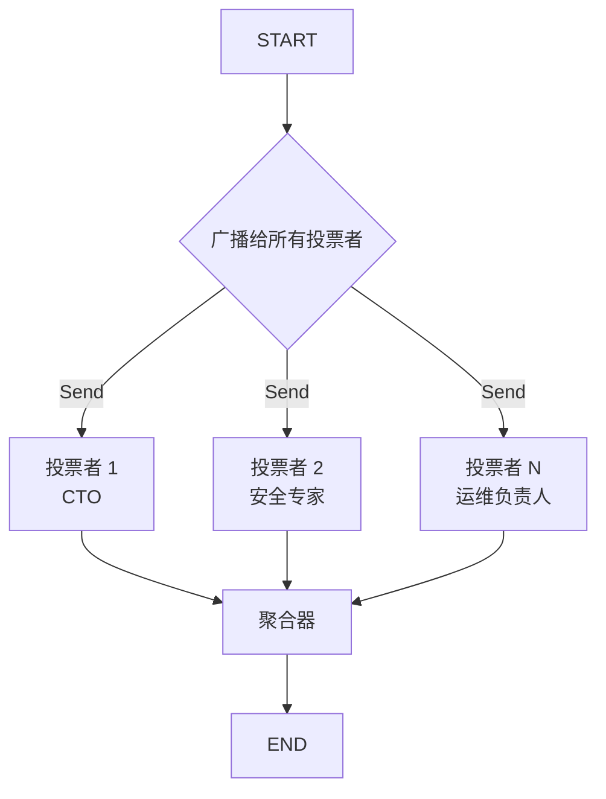

# Voting Pattern（投票决策模式）

> 多个 Agent 独立处理相同输入并投票，通过多数票、加权票或全票一致的策略聚合结果。

## 适用场景

- **架构或技术决策**——需要不同专家视角（安全、性能、可维护性）
- **多准则评估**——利益相关者有不同专业等级和权重
- **共识建立**——需要多方独立确认
- **风险评估**——独立审查员检查不同关注点
- **最佳实践验证**——多个 Agent 按不同标准检查合规性

## 不适用场景

- **时间敏感的决策**——并行投票仍需所有投票者完成后才能聚合
- **简单的二选一**——微小决策不需要多个 Agent 的开销
- **需要辩论时**——如果投票者需要争论并相互影响，使用 Debate 模式
- **单一专家意见足够时**——不要为一个人能做的决定添加开销

## 架构图



## 核心概念

**Voting Pattern（投票决策模式）** 专为需要收集和综合多方独立观点的决策场景设计。与 **Debate** 的区别：Debate 中 Agent 来回辩论，立场相互影响；Voting 中 Agent 先独立得出结论——没有跨 Agent 影响。

核心特点：
- **广播 fan-out**：通过 LangGraph 的 `Send` API 同时向所有投票者发送相同输入
- **独立决策**：每个投票者在不知道他人选择的情况下独立分析问题
- **多种聚合策略**：
  - `majority`：简单计票
  - `weighted`：按投票者的专业度/相关性加权
  - `unanimous`：全员同意，否则产出修订建议

## 快速开始

```bash
cd patterns/voting
python example.py
```

## 核心代码

```python
def _broadcast(self, state: VotingState) -> list[Send]:
    """分发：一个 Send 对应一个投票者，并行执行"""
    return [
        Send("voter", {
            "voter_name": voter["name"],
            "voter_expertise": voter["expertise"],
            "question": state["question"],
        })
        for voter in state["voters"]
    ]
```

## 工作流程

1. **广播**：图将同一问题同时分发给所有投票者
2. **并行投票**：每个投票者独立分析问题并做出决策
3. **聚合**：聚合器收集所有投票，按选定策略产出最终决策

## 配置参数

| 参数 | 默认值 | 说明 |
|------|--------|------|
| `model` | `gpt-4o-mini` | LLM 模型名称 |
| `llm` | `None` | 预配置的 LLM 实例 |
| `voting_strategy` | `majority` | 策略：`majority`、`weighted` 或 `unanimous` |

## 与其他模式对比

| 维度 | Voting | Debate | Reflection | Hierarchical |
|------|--------|--------|------------|--------------|
| Agent 关系 | 独立 | 对抗性 | 自我评审 | Manager-Worker |
| 轮数 | 1（并行） | 多轮 | 多轮 | 1（并行 Worker） |
| 跨 Agent 影响 | 无 | 直接 | 自我 | 无 |
| 聚合方式 | 计票 | Moderator | 自我 | Manager 综合 |
| 最佳场景 | 决策制定 | 冲突解决 | 质量提升 | 多维度研究 |
