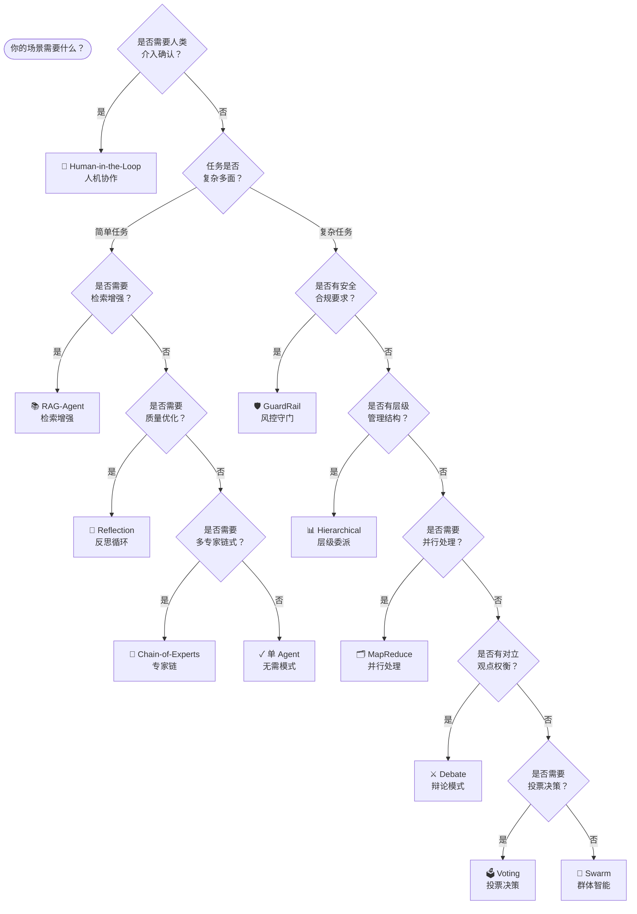

# 选型指南

根据你的业务场景，选择合适的设计模式：

_点击模式名称可跳转到对应中文文档_

| 场景 | 推荐模式 | 原因 |
|------|----------|------|
| 需要迭代优化输出质量 | [反思循环](../patterns/reflection_zh.md) | 自我评审循环，持续改进 |
| 需要多角度分析问题 | [辩论模式](../patterns/debate_zh.md) | 对抗性辩论，全面评估 |
| 需要并行处理大量数据 | [MapReduce](../patterns/map_reduce_zh.md) | 并行扇出，聚合结果 |
| 需要层级管理任务分配 | [层级委派](../patterns/hierarchical_zh.md) | Manager 统筹，Worker 执行 |
| 需要多 Agent 投票决策 | [投票决策](../patterns/voting_zh.md) | 民主决策，少数服从多数 |
| 需要安全内容过滤 | [风控守门](../patterns/guardrail_zh.md) | 检查点拦截，风险控制 |
| 需要知识库检索增强 | [RAG-Agent](../patterns/rag_agent_zh.md) | 动态检索，知识增强 |
| 需要专家依次处理 | [专家链](../patterns/chain_of_experts_zh.md) | 专业化分工，顺序传递 |
| 需要人类介入确认 | [人机协作](../patterns/human_in_the_loop_zh.md) | 关键节点，人工审批 |
| 需要去中心化协作 | [群体智能](../patterns/swarm_zh.md) | 动态协调，自组织 |
