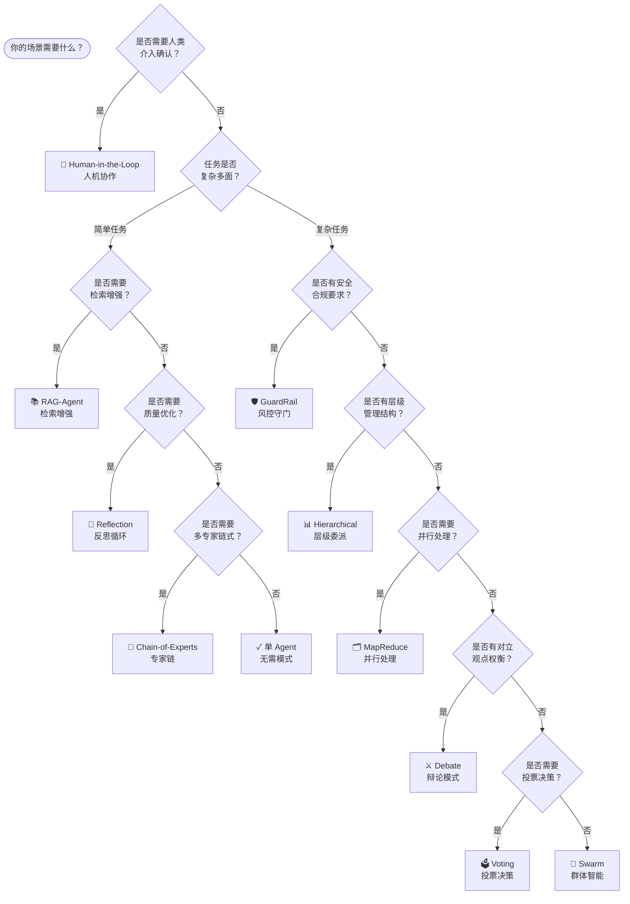

<style>
.patterns-grid {
  display: grid;
  grid-template-columns: repeat(auto-fill, minmax(280px, 1fr));
  gap: 1rem;
  margin: 1.5rem 0;
}

.pattern-card {
  background: var(--md-background-bg-color);
  border: 1px solid var(--md-typeset-table-border-color);
  border-radius: 12px;
  padding: 1.25rem;
  transition: all 0.3s ease;
}

.pattern-card:hover {
  transform: translateY(-4px);
  box-shadow: 0 8px 24px rgba(0, 0, 0, 0.1);
  border-color: var(--md-primary-fg-color);
}

.pattern-card h3 {
  margin: 0 0 0.5rem 0 !important;
  color: var(--md-primary-fg-color);
  font-size: 1rem;
}

.pattern-card p {
  margin: 0 !important;
  font-size: 0.9rem;
  color: var(--md-typeset-prose-color);
}

.pattern-links {
  margin-top: 0.75rem;
  font-size: 0.85rem;
}

.pattern-links a {
  color: var(--md-primary-fg-color);
  text-decoration: none;
}

.pattern-links a:hover {
  text-decoration: underline;
}

.pattern-desc {
  font-size: 0.85rem !important;
  color: #607D8B !important;
  margin-bottom: 0.5rem !important;
}

.compare-table {
  width: 100%;
  border-collapse: separate;
  border-spacing: 0;
  margin: 1.5rem 0;
  border-radius: 12px;
  overflow: hidden;
  box-shadow: 0 4px 16px rgba(0, 0, 0, 0.08);
}

.compare-table th {
  background: var(--md-primary-fg-color) !important;
  color: white !important;
  padding: 1rem !important;
  text-align: left !important;
  font-weight: 600;
}

.compare-table td {
  padding: 0.875rem 1rem !important;
  border-bottom: 1px solid var(--md-typeset-table-border-color);
}

.compare-table tr:last-child td {
  border-bottom: none;
}

.compare-table tr:hover td {
  background: rgba(0, 150, 136, 0.04);
}

.compare-table a {
  color: var(--md-primary-fg-color);
  text-decoration: none;
  font-weight: 500;
}

.compare-table a:hover {
  text-decoration: underline;
}

.guide-banner {
  display: grid;
  grid-template-columns: repeat(auto-fit, minmax(200px, 1fr));
  gap: 1rem;
  margin: 2rem 0;
}

.guide-card {
  background: linear-gradient(135deg, rgba(0, 150, 136, 0.08), rgba(0, 150, 136, 0.03));
  border: 1px solid rgba(0, 150, 136, 0.2);
  border-radius: 12px;
  padding: 1.5rem;
  text-align: center;
  transition: all 0.3s ease;
}

.guide-card:hover {
  transform: translateY(-4px);
  box-shadow: 0 8px 24px rgba(0, 150, 136, 0.15);
  border-color: var(--md-primary-fg-color);
}

.guide-card h3 {
  margin: 0 0 0.5rem 0 !important;
  color: var(--md-primary-fg-color);
}

.guide-card p {
  margin: 0 !important;
  font-size: 0.9rem;
  color: #607D8B;
}

.guide-card a {
  color: inherit;
  text-decoration: none;
}
</style>

# AgentFlow

基于 LangGraph 的多 Agent 协作设计模式实战库，提供 10+ 种经过验证的模式，每个模式都有完整代码、架构图、适用场景分析和性能对比。

## Quick Decision Tree



_点击模式名称可跳转到对应中文文档_

## Patterns

<div class="patterns-grid" markdown>

<div class="pattern-card">

<h3>反思循环 (Reflection)</h3>
<p class="pattern-desc">迭代式自我改进，写作 Agent + 评审 Agent 循环</p>
<p class="pattern-links"><a href="patterns/reflection/">English</a> | <a href="patterns/reflection_zh/">中文</a></p>
</div>

<div class="pattern-card">

<h3>辩论模式 (Debate)</h3>
<p class="pattern-desc">多 Agent 对抗性辩论，Moderator 裁决共识</p>
<p class="pattern-links"><a href="patterns/debate/">English</a> | <a href="patterns/debate_zh/">中文</a></p>
</div>

<div class="pattern-card">

<h3>MapReduce</h3>
<p class="pattern-desc">并行扇出处理，动态调度 + 结果聚合</p>
<p class="pattern-links"><a href="patterns/map_reduce/">English</a> | <a href="patterns/map_reduce_zh/">中文</a></p>
</div>

<div class="pattern-card">

<h3>层级委派 (Hierarchical)</h3>
<p class="pattern-desc">Manager → Workers 层级协作</p>
<p class="pattern-links"><a href="patterns/hierarchical/">English</a> | <a href="patterns/hierarchical_zh/">中文</a></p>
</div>

<div class="pattern-card">

<h3>投票决策 (Voting)</h3>
<p class="pattern-desc">多 Agent 独立决策 → 投票聚合</p>
<p class="pattern-links"><a href="patterns/voting/">English</a> | <a href="patterns/voting_zh/">中文</a></p>
</div>

<div class="pattern-card">

<h3>风控守门 (GuardRail)</h3>
<p class="pattern-desc">主 Agent + 安全守门检查点</p>
<p class="pattern-links"><a href="patterns/guardrail/">English</a> | <a href="patterns/guardrail_zh/">中文</a></p>
</div>

<div class="pattern-card">

<h3>RAG-Agent</h3>
<p class="pattern-desc">Agent + 条件检索增强</p>
<p class="pattern-links"><a href="patterns/rag_agent/">English</a> | <a href="patterns/rag_agent_zh/">中文</a></p>
</div>

<div class="pattern-card">

<h3>专家链 (Chain-of-Experts)</h3>
<p class="pattern-desc">任务在专家 Agent 间依次传递</p>
<p class="pattern-links"><a href="patterns/chain_of_experts/">English</a> | <a href="patterns/chain_of_experts_zh/">中文</a></p>
</div>

<div class="pattern-card">

<h3>人机协作 (Human-in-the-Loop)</h3>
<p class="pattern-desc">关键节点等待人类确认</p>
<p class="pattern-links"><a href="patterns/human_in_the_loop/">English</a> | <a href="patterns/human_in_the_loop_zh/">中文</a></p>
</div>

<div class="pattern-card">

<h3>群体智能 (Swarm)</h3>
<p class="pattern-desc">去中心化 Agent 群体协作</p>
<p class="pattern-links"><a href="patterns/swarm/">English</a> | <a href="patterns/swarm_zh/">中文</a></p>
</div>

</div>

## Quick Start

```bash
# 1. 安装
pip install agentflow

# 2. 配置 API Key
echo "OPENAI_API_KEY=sk-..." > .env

# 3. 运行示例
python -m agentflow.patterns.reflection.example
```

## Compare Patterns

<table class="compare-table">
<thead>
<tr>
<th>场景</th>
<th>推荐模式</th>
</tr>
</thead>
<tbody>
<tr>
<td>需要迭代优化质量</td>
<td><a href="patterns/reflection_zh/">反思循环</a></td>
</tr>
<tr>
<td>需要多角度辩论</td>
<td><a href="patterns/debate_zh/">辩论模式</a></td>
</tr>
<tr>
<td>需要并行处理大量数据</td>
<td><a href="patterns/map_reduce_zh/">MapReduce</a></td>
</tr>
<tr>
<td>需要层级管理</td>
<td><a href="patterns/hierarchical_zh/">层级委派</a></td>
</tr>
<tr>
<td>需要多 Agent 投票决策</td>
<td><a href="patterns/voting_zh/">投票决策</a></td>
</tr>
<tr>
<td>需要安全过滤</td>
<td><a href="patterns/guardrail_zh/">风控守门</a></td>
</tr>
<tr>
<td>需要知识检索增强</td>
<td><a href="patterns/rag_agent_zh/">RAG-Agent</a></td>
</tr>
<tr>
<td>需要专家链式处理</td>
<td><a href="patterns/chain_of_experts_zh/">专家链</a></td>
</tr>
<tr>
<td>需要人类介入确认</td>
<td><a href="patterns/human_in_the_loop_zh/">人机协作</a></td>
</tr>
<tr>
<td>需要去中心化协作</td>
<td><a href="patterns/swarm_zh/">群体智能</a></td>
</tr>
</tbody>
</table>

## Guide

<div class="guide-banner">

<a href="guide/getting-started/">
<div class="guide-card">
<h3>快速开始</h3>
<p>安装、配置、运行第一个示例</p>
</div>
</a>

<a href="guide/selection/">
<div class="guide-card">
<h3>选型指南</h3>
<p>根据场景选择合适的模式</p>
</div>
</a>

</div>
